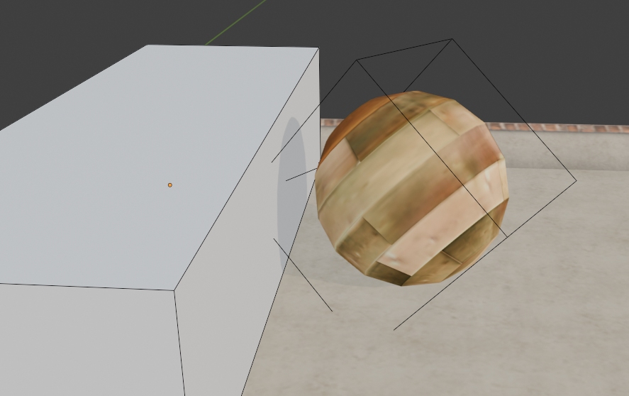

# Death Zone

The death zone is a special object in the Ballance game. When the player's ball touches it, they will die and return to the respawn point.

The death zone is determined by its bounding box. When the player's ball's bounding box overlaps with the death zone's bounding box, it is determined as contact.

::: tip Hint
The bounding box can follow the object's rotation and scaling, so the death zone can be arbitrarily rotated and scaled.
:::

Since the death zone handles detection based on the bounding box, we can simply treat both the player's ball and the death zone as cuboids. For example, in the situation shown in the figure below, even though visually the player's ball and the death zone are not touching, the player's ball death can still be triggered.

Using death zones of different shapes is meaningless. At the game level, only the square bounding box will be used for determination. Therefore, to maintain a basically correct visual preview, we recommend **using only cuboids when creating death zones**, which is simple and intuitive.

::: tip Important Reminder
Remember to hide the death zone before publishing the map!
:::
