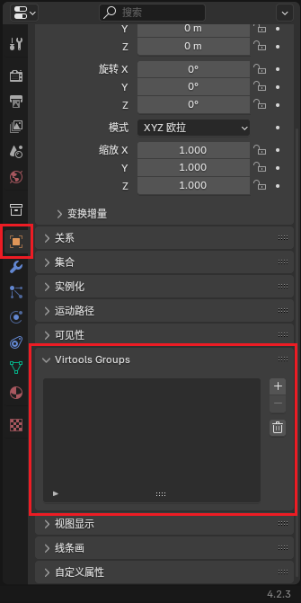

# Grouping

Groups are an important concept in Virtools. Through grouping, Ballance knows which objects are floors, which are mechanisms, and which are decorations, and assigns them different properties and behaviors. Only objects grouped into corresponding groups will have corresponding functions, otherwise they are just models that can be seen but cannot be interacted with.

More detailed grouping information and rules can be found on the [Ballance Wiki Grouping Page](https://ballance.jxpxxzj.cn/wiki/%E5%BD%92%E7%BB%84).

In Blender, objects generated by plugins and objects in the mapping asset library are already grouped. Unless there are special requirements, generally no excessive adjustments are needed.

## Basic Rules

First, let's briefly introduce the concept of Virtools groups:

- Each group has a name, such as `Phys_Floors`, `Sector_01`, `My_Custom_Group`, etc.
- Each group contains a list of objects. Objects in this list are referred to as being grouped into this group.
- The same object can be grouped into multiple groups.
- Groups do not nest within each other.

Ballance assigns different characteristics to objects within groups through some [predefined group names](#ballance-predefined-groups). For example, objects in the floors group (`Phys_Floors`) will be physicalized, giving them collision boxes; objects in the props group will be replaced as real mechanism props, etc.

For example, a walkable floor should be grouped into the following groups:

- `Phys_Floors`: To physicalize the floor, otherwise it cannot collide with the player's ball.
- `Sound_HitID_01`: When the player collides with objects in this group, a concrete floor collision sound effect will be played.
- `Sound_RollID_01`: When the player's ball rolls on objects in this group, a concrete floor rolling sound effect will be played.
- `Shadow`: When the player's ball is within a certain distance above objects in this group, a shadow will be cast.

## Grouping in Blender

::: warning Note
This function is provided by BallanceBlenderPlugin. Please ensure you have [correctly installed BallanceBlenderPlugin](../intro/installations.md#ballance-blender-plugin).
:::

In Blender, you can find the `Virtools Groups` menu within the object properties panel of each object, where you can add all predefined groups supported by Ballance, and also add groups with custom names. All group information will be automatically converted to Virtools groups when exporting.

Additionally, objects generated by plugins and objects in the mapping asset library are already grouped. Unless there are special requirements, generally no excessive adjustments are needed.

## Ballance Predefined Groups

Ballance provides a series of predefined groups. By grouping objects into these groups, you can make the objects have corresponding characteristics. The table below lists all predefined group names and their functions:

### Special Groups

Special groups are a very important part of a level. Objects in these groups guarantee normal level gameplay. If some of these are missing, it may lead to the level being unplayable, and may even cause the level to be unable to be entered, the game to freeze, and other issues.

Due to the special nature of these groups, some objects within the groups have strict naming rules, and the specific rules are listed in the table.

| Group Name     | Meaning             | Object Naming Rules in Group | Notes                                                      |
| -------------- | ------------------- | ---------------------------- | ---------------------------------------------------------- |
| PS_Levelstart  | Starting save point | PS_FourFlames_01             | Only can have one initial save point object                |
| PC_Checkpoints | Section save points | PC_TwoFlames_0X              | Where X is section number **minus one**                    |
| PR_Resetpoints | Respawn point       | PR_Resetpoint_0X             | Where X is section number                                  |
| PE_Levelende   | Spaceship           | PE_Balloon_01                | Only can have one spaceship object                         |
| DepthTestCubes | Death zone          | No requirements              | Death zone range is determined by the object's BoundingBox |

::: tip Hint
No need to worry about the above naming rules. By default, BallanceBlenderPlugin will automatically handle them for us.
:::

### Fixed Object Groups

**Fixed collidable objects** in the game need to be grouped into the groups shown in the table below. These groups will give them physical effects, enabling them to collide with other objects.

| Group Name        | Meaning                                    | Notes                                                                                               |
| ----------------- | ------------------------------------------ | --------------------------------------------------------------------------------------------------- |
| Phys_Floors       | To physicalize objects in group as floors  |                                                                                                     |
| Phys_FloorRails   | To physicalize objects in group as rails   |                                                                                                     |
| Phys_FloorStopper | To physicalize objects in group as Stopper | Stopper cannot collide with player's ball but can collide with mechanism props and other objects |

::: tip What is physicalization?
Physicalization (Physicalize in English) means giving objects collision effects, making them able to collide with other objects. Objects that are not physicalized have no physical properties in the game and cannot collide.
:::

In addition to physical effects, complete objects also need certain decorations to give them interactive sound effects, shadows, and other effects.

| Group Name      | Meaning                                                |
| --------------- | ------------------------------------------------------ |
| Sound_HitID_01  | Concrete collision sound effect group                  |
| Sound_HitID_02  | Wooden board collision sound effect group              |
| Sound_HitID_03  | Steel rail collision sound effect group                |
| Sound_RollID_01 | Concrete rolling sound effect group                    |
| Sound_RollID_02 | Wooden board rolling sound effect group                |
| Sound_RollID_03 | Steel rail rolling sound effect group                  |
| Shadow          | Makes objects in group able to cast player ball shadow |

### Mechanism Prop Groups

| Group Name    | Meaning                |
| ------------- | ---------------------- |
| Sector_0**X** | Section **X**          |
| P_Trafo_Paper | Paper ball changer     |
| P_Trafo_Stone | Stone ball changer     |
| P_Trafo_Wood  | Wood ball changer      |
| P_Ball_Paper  | Prop Paper Ball        |
| P_Ball_Stone  | Prop Stone Ball        |
| P_Ball_Wood   | Prop Wood Ball         |
| P_Box         | Box                    |
| P_Dome        | Dome                   |
| P_Extra_Life  | Extra Life Ball        |
| P_Extra_Point | Extra Point Ball       |
| P_Modul_01    | Active wooden fence    |
| P_Modul_03    | Elevator               |
| P_Modul_08    | Seesaw                 |
| P_Modul_17    | Single Pendulum        |
| P_Modul_18    | Fan                    |
| P_Modul_19    | Two-Way Inclined Board |
| P_Modul_25    | Push Board             |
| P_Modul_26    | Sandbag                |
| P_Modul_29    | Soft Wooden Bridge     |
| P_Modul_30    | Spring Board           |
| P_Modul_34    | Falling Rock           |
| P_Modul_37    | T-Board                |
| P_Modul_41    | Box Float Board        |
