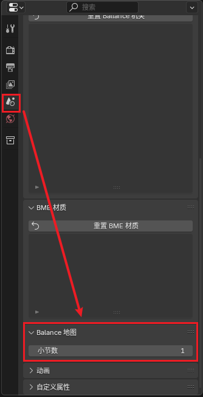
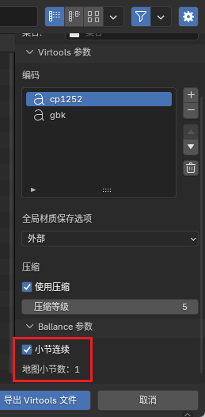

# Level

Custom Ballance maps generally use a **Level** as a unit. For example, the original Ballance has 13 independent levels. Each Ballance level is stored in an NMO file.

## Level Basic Elements

A basic Ballance level must at least include:

- A starting four-flame checkpoint (note that it's flame, not bottom floor; floor is not mandatory).
- A respawn point (first section).
- A spaceship (balloon).

If these objects are not included, even if the level is exported, Ballance will refuse to load it.

## Section Mechanism

Sections are used to separate the loading of mechanisms in each part. By default, each level can have up to 8 independent sections.

The reason for the existence of the "Section" mechanism is not just for save points. The game processes mechanisms and props of each section independently. Each section will only load the mechanism props of the current section. In the game, it's easy to notice that whenever passing a checkpoint flame, the mechanism props of one section will disappear directly, and the mechanism props of the next section will be loaded out. When the player's ball dies, all mechanism props of the current section will reset to their initial state.

::: tip Hot Tip
In the era of poor device performance and tight memory, loading maps by sections was a very smart resource-saving method. (In fact, Ballance can be seen almost everywhere with these resource-saving tricks.)

Nowadays, even loading all sections at once won't cause much impact on game performance, but some mappers also use the section mechanism to create maps with special mechanics (for example, maps where only one section of floor exists, implementing diverse gameplay through mechanism props from different sections).
:::

## Respawn Points and Checkpoint Flames

If only looking through the game, one might think that respawn points and checkpoint flames are the same object, because the respawn point in the game is always at the checkpoint flame. But actually, they are two independent objects. When mapping, it is recommended to clearly distinguish these two special mechanisms.

The checkpoint flame is an important mechanism that controls the flame and section switching triggers. When the player's ball touches the checkpoint flame of the next section, it will trigger section switching and set the respawn point to the location of the next section's respawn point. The checkpoint flame of the first section is 4 flames, while others are 2 flames.

The respawn point only stores object information needed for respawning. When the player's ball dies, it will return to the position of the last respawn point, and data such as rotation angle, scale, etc. will synchronize with the respawn point. When mapping, the direction of the respawn point arrow indicates the direction the player's camera will face after respawning.

::: tip Hot Tip
Some maps use this feature to create so-called "teleportation gates". That is, by separating the respawn point from the checkpoint flame, making the player, upon touching the checkpoint flame, set the respawn point to another location, achieving the so-called "death ball teleportation".
:::

When mapping, generally, the horizontal coordinates of the respawn point should be the same as the checkpoint flame, and the vertical coordinates of the respawn point (Z axis in Blender, Y axis in Virtools) should be higher than the checkpoint flame. For specific values, see the table below:

| Checkpoint Flame         | Height Difference Reference Value | Notes                                                            |
| ------------------------ | --------------------------------- | ---------------------------------------------------------------- |
| Initial Checkpoint Flame | 3.65                              | Calculated from statistics of original levels, below is the same |
| Section Checkpoint Flame | 3.33 (approximate value)          | Actual reference value is 3.3258                                 |

## One-Section Level Bug

We do not recommend creating levels with only one section, although playing them has no issues. Because for maps with only one section, Ballance will have a Bug when rendering the starting four-flame checkpoint, manifesting as the flame particles appearing as unnatural triangles, and after entering the level, you cannot use Esc to open the menu, making it impossible to exit the level, and you can only forcibly close the game.

To avoid this situation, please add the checkpoint (two-flame checkpoint) of the first section and the respawn point of the second section, making the level have **at least two sections**.

## Special One-Section Map

Although the game has a one-section level Bug, we still have a way to make a single-section map.

The game's level completion judgment depends on whether there is a spaceship (balloon), and the appearance of the spaceship depends on the number of section groups (not the number of checkpoints). Therefore, we can **add the second section's checkpoint flame and respawn point to avoid the Bug**, but not create the second section group (i.e., there's nothing in the second section). At this time, the spaceship will appear directly in the first section.

When making a one-section map using Blender and BBP, you can first add the required objects according to [Level Basic Elements](#level-basic-elements), then add `Mechanism - Section Pair` to the second section. At this time, although there are the respawn point and checkpoint of the second section, we can move them to a place where normal gameplay won't see. Therefore, you only need to put the checkpoint flame in a far place, and you can create the illusion that the level has only one section.

The most important step is **before exporting**, in the `Scene` menu, find the Ballance Map options, and adjust the number of sections to **1**.

::: warning Note
If you want to make a one-section map, you must ensure that except for the first section, there are no other sections. That is, do not put any objects into other section groups.

You might ask, then why can we place the second section's checkpoint flame and respawn point to avoid the Bug? The answer is simple, because **checkpoint flames and respawn points do not need to be grouped into section groups**, their section numbers are directly written in the object names.
:::

In the export options, there is a `Ballance Parameter - Section Continuous` option. Please ensure this function is enabled, and ensure the displayed number of sections is 1.

