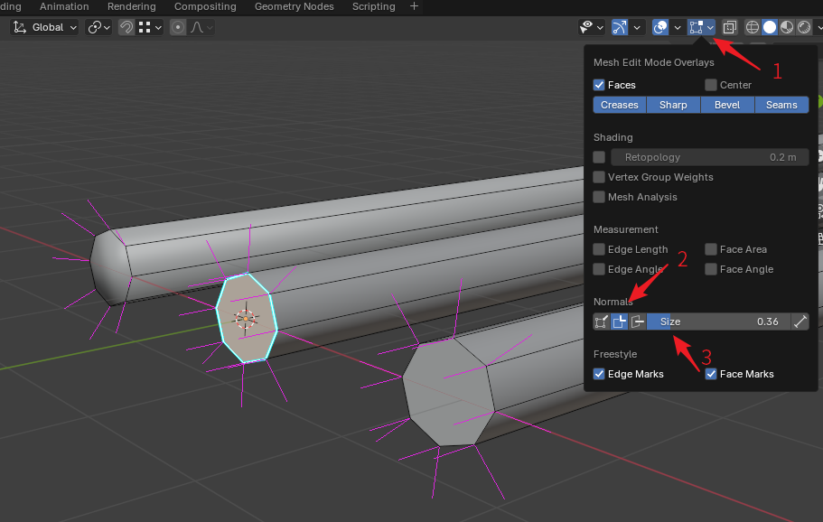
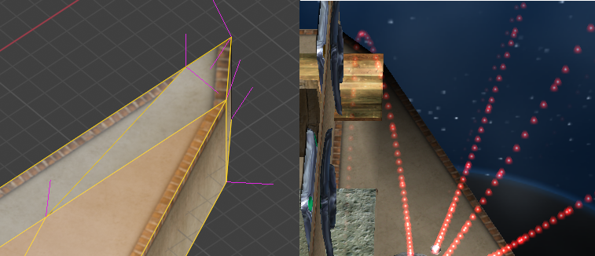
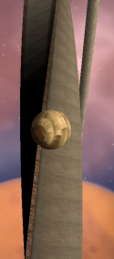

# Floor Blackening

When creating Ballance maps using Blender, there will occasionally be a situation where the Floor display appears black after entering the game. Although this is about Floor blackening, it is not limited to Floors. Rails, Wooden Boards, and even Decorations can also turn black if not set reasonably. The term Floor here is a general term.

In summary, Floor blackening in Ballance is caused by only two reasons: **normal errors** or **material errors**. Or more complexly, both. Below, I will introduce these two errors separately and how to solve them.

## Normal Errors

### Rail Joints

The normals at Rail joints are the most error-prone place for beginners, that is, the place where black spots are most likely to appear. The following figure shows how to open normal display and common normal errors at Rail joints.

To display normals, we first need to enter Edit Mode, then open the Viewport Overlays panel in the upper right corner (arrow 1), then find the Normal column, click to check the second normal display option (arrow 2), which will open the split normal display. Then adjust the normal display length on the right until the length of the pink normals in the 3D Viewport is appropriate.

The figure shows from left to right: incorrect Rail joint normals, and correct Rail joint normals modified using two different solutions. Generally speaking, we want Rails to be smooth, so it is natural to right-click the Rail and select Auto Smooth, but this operation will cause the normals at the Rail joint to be smoothed, which is not what we want. To convert the error on the far left to the correct normal on the right, one solution is to select the joint's edges, then select the menu `Edge - Mark Sharp`, mark them as sharp edges, so that the Rail's side and top normals will be separated, becoming what we want. This is what the Rail joint in the middle looks like. Another method is to select the Rail section alone, select the menu `Face - Shade Flat`, and separately change the section to flat shading, which can also achieve the same effect.

Finally, there is another simple and crude solution, which is to right-click the Rail in Object Mode and select Auto Smooth, and set the angle to 50. However, please note that after setting is complete, please go to the modifier column and apply the Auto Smooth modifier, because starting from Blender 4.1, smooth shading exists as a modifier, but BBP will ignore modifiers when saving objects, so please be sure to apply all modifiers before saving the map.

### Floor Normals

The following figure shows a problem where Floor blackening is caused by disordered Floor normals.

The left side is a screenshot of this Floor after opening normal display in Blender, and the right side is what this Floor looks like in the game. Obviously, you can notice that the normals at the Floor corners are wrong, especially the side normals, which point in the wrong direction. By flexibly using sharp edges and flat smooth shading, you can fix these normal errors so that they render correctly in the game.

### Unable to Fix No Matter What

Generally speaking, normals can be fixed by recalculating, or by flat smooth shading. But if you encounter a situation where no matter how you operate, the normals just don't listen (this usually happens when editing imported or auto-generated objects), this is mostly due to the object's custom normal data not being deleted. The solution is to first select all faces, then click the menu `Mesh - Normals - Reset Vectors` to clear all custom normal data. In this way, the normals should obey your instructions.

## Material Errors

Material errors are also one of the causes of Floor blackening. Many early maps had Floor blackening due to incorrect material settings, and were even forced to add light bulbs to solve the problem of Floors being too dark. The most common error is applying the Floor top texture to the Floor side, which then appears black, as shown in the figure below:

You will find that the side material displays normally everywhere, but when the top material is transferred to the side, it becomes completely black. This error is actually caused by Ballance's lighting system. The main light source in the Ballance game is a sunlight with a tilted angle, so the side that cannot be illuminated by the sunlight will be completely black. You need to set the Emissive option in the material to white to make up for this ugliness. This is exactly what the Floor side material does. If you directly apply the Floor top material that does not have white Emissive compensation to the side, it will naturally turn black.

There are two solutions. One is to open the official or maps created by others to see what material values others set in similar structures. This is a universal solution. Another solution is to use the BMERevenge Floor creation function built into the BBP plugin. The BMERevenge Floor creation function is configured with two special materials: `BMELightingFloorTopBorder` and `BMELightingFloorTopBorderless` in order to create Floors with a height greater than 5. If you have ever inserted a Floor with a height greater than 5 in the map file, these two materials will be automatically generated. You can directly use these two materials to create. Although they look like Floor top materials, they can display normally on the side and will not turn black.

By the way, if you observe the tilted Wooden Boards at the beginning of Level 2 carefully, you will find that the upper surface materials of the boards tilted to the left and tilted to the right are different, with subtle differences between the two. This is exactly a compensation for sunlight. Through this compensation, they are forced to look no different in the game.
