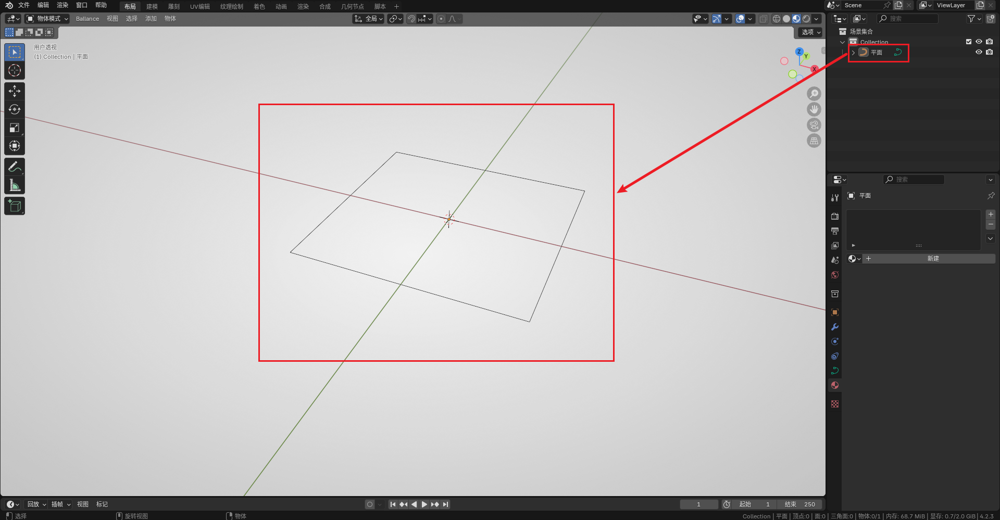
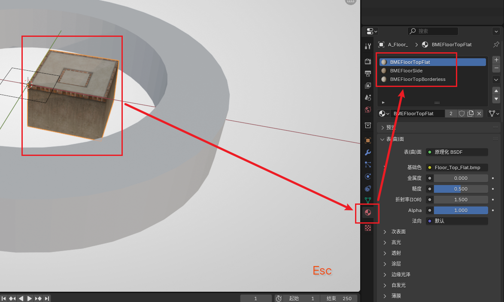
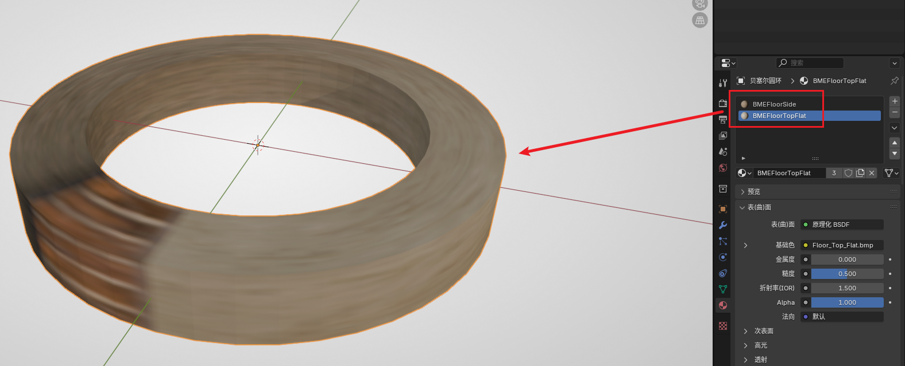
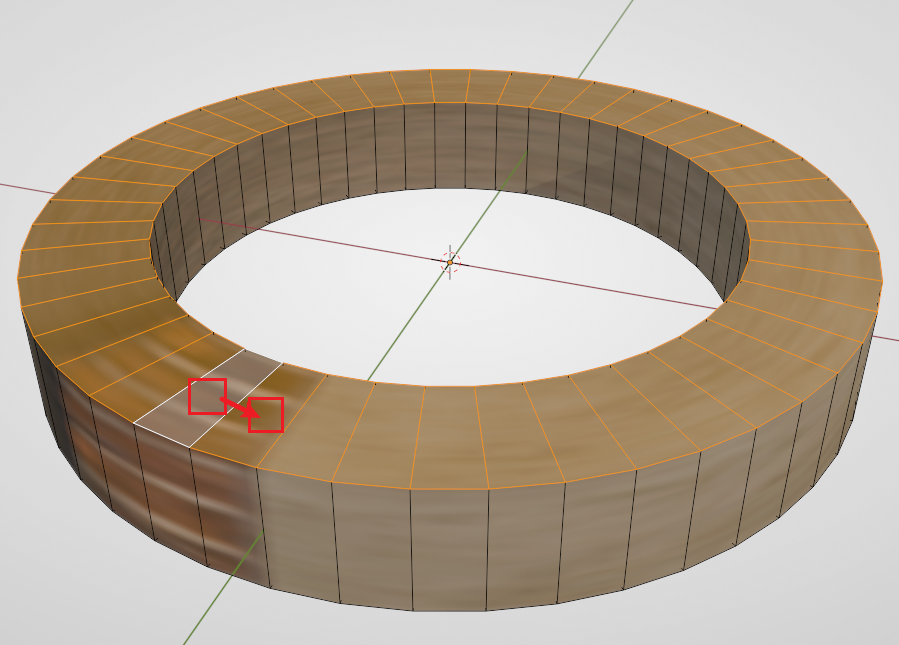
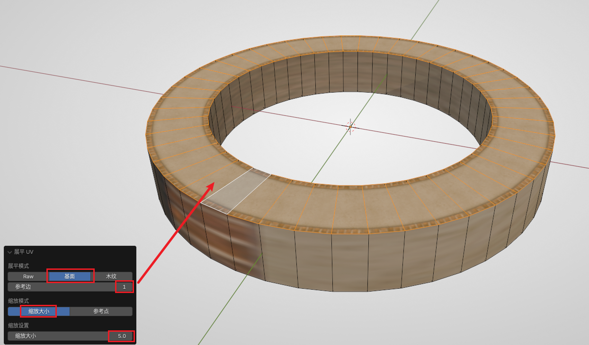
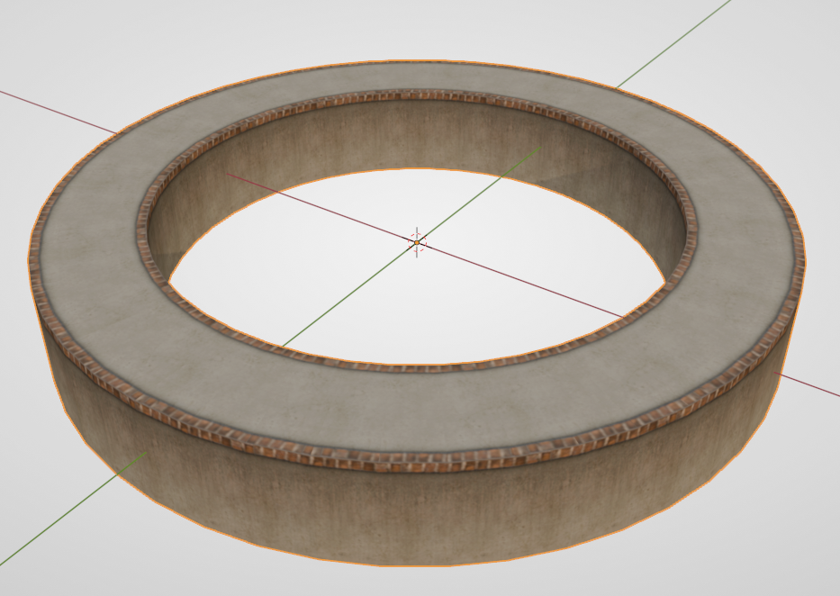

# Sampling for Floors

Beginners are advised to start with [Sampling for Rails](sampling-rail#sampling). This article will no longer describe the details of sampling, but will focus on how to create Floors based on curves.

## Preparing Section

Since BBP does not provide a Floor section, we need to build it ourselves. Fortunately, Floor curves are very easy to build.

First, you can directly create a Plane in `Add - Mesh - Plane`, and set the size of the Plane to 5 in the interactive box in the lower left corner, which is the cross-sectional size of the standard Ballance Floor.

Then enter Edit Mode, press `3` to enter Face selection mode, select the Plane, press `X` and select **Only Face**. This operation will delete the face but keep its border.

Finally, exit Edit Mode, right-click to convert it to a curve. The final result is shown in the figure below:

## Drawing Curves and Sampling

Create arbitrary curves in Blender (this tutorial will also use a Bezier ring as an example). Reminder again: **Remember that curves cannot use the scale operation.**

The sampling operation is consistent with Rail sampling. See [Sampling for Rails](sampling-rail#sampling). After sampling is complete, remember to convert the Floor to a mesh for subsequent operations.

The Floor just sampled is likely **a mess** ~~(literally)~~. At this time, we can first right-click to set the sampling result to "Flat Shading", which makes it easier to observe in subsequent operations.

## Post-processing

The "Grouping" and "Flipping Faces" operations can refer to the [Post-processing Section](sampling-rail#post-processing) of Sampling for Rails, just group it into the Floor group. I won't go into details here, and will only explain the parts different from Rails.

### Materials

Floor materials are relatively complex because they involve materials for different faces.

First, we add a Ribbon Platform from BBP, because it has all the materials we need to create **Flat Floors**. As shown in the figure below:

Mainly `BMEFloorTopFlat` and `BMEFloorSide`. After creating the materials, we can delete this Floor. If your map already has these materials, you don't need to create this Floor.

Then go back to our sampled Floor, create two new material slots, and add the above two materials to this Floor. (Remember to flip the face if the material is applied to the wrong face)

Then enter Edit Mode, use the `Alt` key to loop select. First, loop select the top face. The method is: first click to select a face, then hold `Alt` and select a face next to it to loop select.

After selecting all top faces, select `BMEFloorTopFlat` in the material panel, then click **Assign** to apply the top face material to the top face. But the current UV is not correct. We need to use BBP's UV tool to flatten UV. Keep the top face selected, then select `Flatten UV` in the Ballance menu. Then observe the dialog box in the lower left corner. We need to select **Floor-specific flatten mode** (the second item), select **Scale by size** for the scale mode, and fill in 5 for the size in the scale settings. Then adjust the **Reference Edge** in the dialog box (generally you can just increase from 0 upwards) until your Floor top face becomes normal, as shown in the figure below:

Similarly, using loop selection and flattening UV, you can assign the Floor side material as: `BMEFloorSide`. The operation is roughly the same as the top face, so I won't go into too much detail. The final product is shown in the figure below:

### Deleting and Filling Faces

Since the Floor bottom face is not visible in the original Ballance game, we can delete it to reduce the storage space occupied by the model. Similarly, use the loop selection function to select the bottom face, then press `X` and select "Face".

If your Floor is not self-closed, you should be able to clearly see that the two ends of the Floor section are empty, which is very unsightly. The solution is also very simple. Select the four vertices of the end face, press F to create a face. Then assign `BMEFloorSide` material to it, and flatten UV.

### Setting Smooth Shading

After all processing is complete, you can set the object to **Auto Smooth Shading**. The angle can be chosen freely depending on the situation. The general standard is: the Floor surface and side will not become a mess, and the side does not show significant fold lines.
