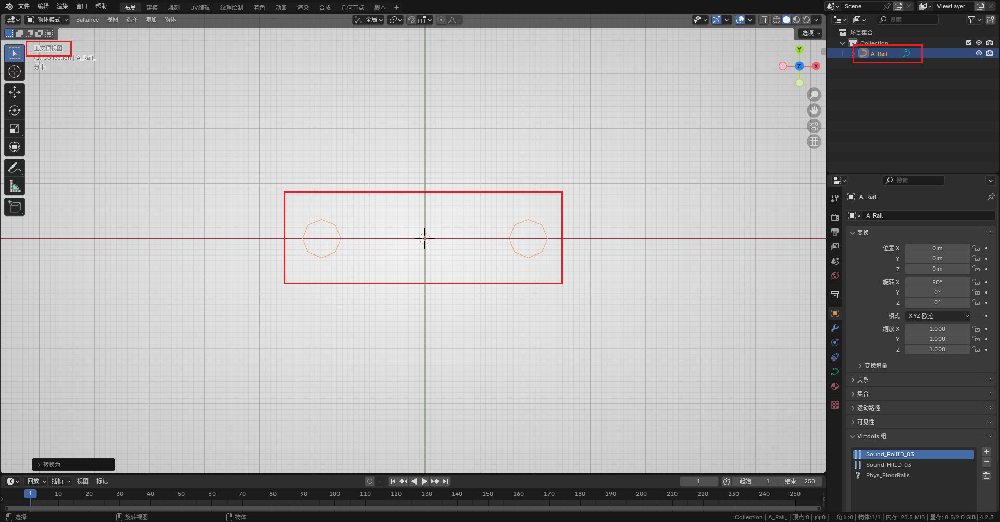
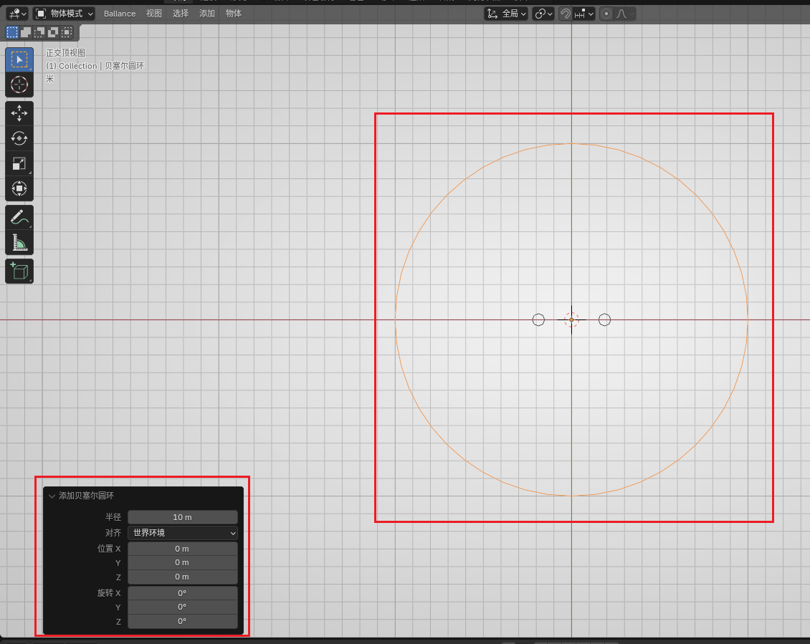
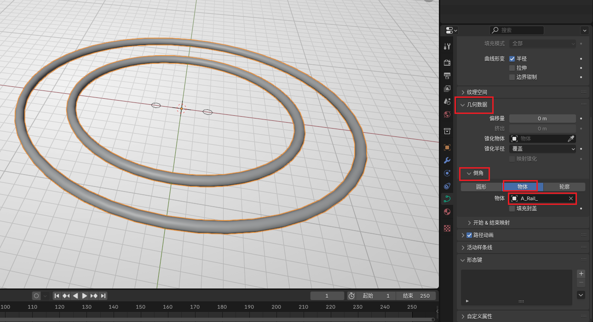
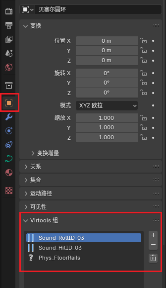
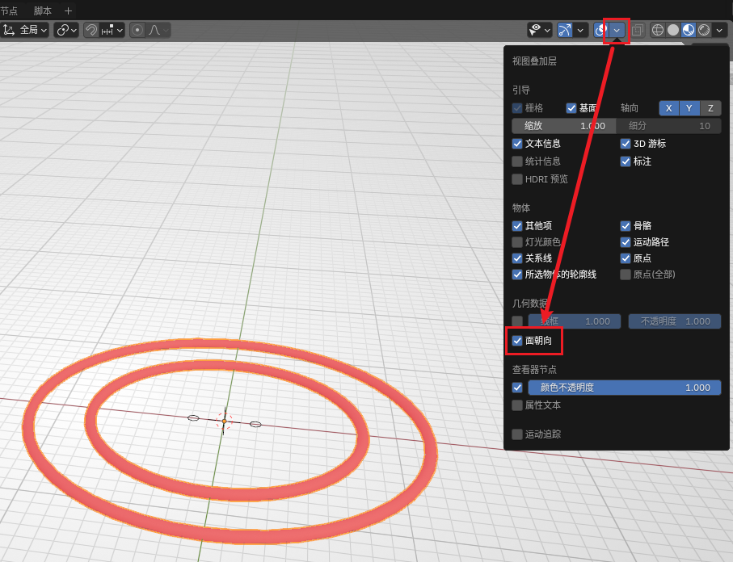

# Sampling for Rails

The last Section of the original game's Level 13 has very complex spiral tracks, which can achieve effects similar to a roller coaster. This chapter will demonstrate how to create fancy Rails.

## Preparing Section

You can use the Rail section provided by BBP. Here we will use double rails as an example.

First, you can directly create a Rail section in `Add - Rails - Rail Section`. Its shape should be two regular octagons. When generating, you can also select single rail in the interactive window in the lower left. At this time, the section cannot be used directly for sampling. We need to do two steps of preprocessing:

- Since the default orientation is the Y axis direction, here we need to rotate it `90°` around the X axis to make it completely lie in the XY plane, then press `Ctrl + A` and select Apply Rotation.
- Right-click to convert it to a curve.

::: tip Tip
Rail sections can also be manually created according to [Rail Parameters](../basic/floor-and-rail#rail-parameters).
:::

If you observe in "Top View" and see two regular octagonal curves, it is successful.

## Drawing Arbitrary Curves

Create arbitrary curves in Blender. Beginners are advised to create a ring (set a larger radius) to try. After becoming proficient, you can create Bezier curves. This tutorial will use the simplest ring as an example.

**Remember that curves cannot use the scale operation.**

## Sampling

In the created curve's panel (not the section), find Geometry Data, select Bevel as "Object", and set the object to the section just created. You can see the generated ring track.

If your curve has corners with large angles, and the produced curved track has distinct edges, you can set the number of segments between every two points at `Data - Shape - Preview Resolution U`. Increasing this value will create more segments, making the final track look smoother. However, please note that too many segments may cause game lag or physics bugs. Under the premise of ensuring visual effects, try to use as few segments as possible.

After sampling is complete, you also need to right-click the curve and convert it to a mesh. After converting to a mesh, the Rail section can be safely deleted (or kept for the next sampling).

After converting to a mesh, the curve can no longer be edited. Be sure to adjust the curve parameters correctly before converting to a mesh.

## Post-processing

### Grouping

The track made with this sampling method has no group information, and directly importing it into the game will result in no collision. You need to manually group it into the three groups as shown in the figure below:

### Flipping Faces

Open "Face Orientation" display as shown in the figure below:

If you observe that the faces of the track are red, it means that the face is facing inward, which will cause incorrect visual effects in the game. At this time, we enter Edit Mode, select all red faces, press `Alt + N`, then select Flip. Observe that the faces turn blue.

### Filling Faces

If your Rail is not a ring Rail, and both ends of the Rail are exposed (neither embedded in the Floor nor connected to other Rails, etc.), then try to fill the end faces, otherwise, you will see hollow Rails in the game.

Enter Edit Mode, select the 8 vertices of the end face, and press F to create a face. By default, normals are handled correctly (that is, the newly added face will not affect the original normal information). If you observe that the end face is not "cut off", but similar to a "round head", then select the Rail and use Auto Smooth, adjusting the angle to `50°`.

### Materials

The track made with this sampling method also has no material information, but fortunately, the material information of Rails is very easy to add. You only need to add `Rail` material in the material panel. If you don't find this material, you can first drag a Guardrail out of the asset library. The Guardrail will have this material. After adding the material, you can delete the unnecessary Guardrail.

If the material extension is not correct, you can select `Rail UV` in the Ballance menu to make the material look like the visual effect in the game.
