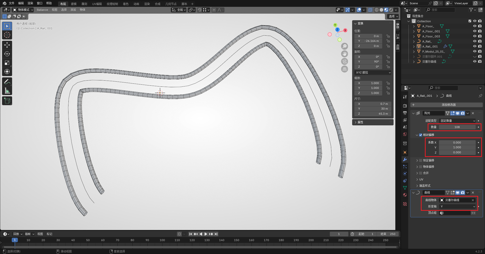

# Sampling Introduction

In 3ds Max, **creating complex Floors and Rails** is generally done using sampling. Blender also has similar operations, mainly the following two:

- Curve Sampling
- Array Modifier + Curve Modifier

The first method is more similar to the sampling operation in Max, but sometimes you need to flexibly use both methods depending on the situation.

## Curve Sampling

See: [Sampling for Rails](sampling-rail), [Sampling for Floors](sampling-floor).

## Modifier-based

This method requires a short Rail as a base object. You can directly use the plugin to add a section of Rail (not a Rail section). And create a curve for backup.

First, add an Array Modifier (`Generate - Array`) in the modifier panel of the Rail. In the **Relative Offset** section, you need to set it manually. The setting method is: whichever axis you want to extend, fill in 1 for that axis (fill in -1 for the opposite direction). Then change **Count** to a larger value. These parameters can be dynamically adjusted later, so you don't need to care about the specific value.

Then continue to add a Curve Modifier (`Deform - Curve`). Set **Curve Object** to the curve created in advance, and change **Deform Axis** to the same axis as the relative offset just now (that is, the axis you just filled 1 or -1 for). At this point, you should be able to see the object array distributed along the curve.

At this point, you can perform further operations based on the effect of the generated object:

- If the distributed length is not enough, you can increase the count parameter of the Array Modifier.
- If the edges are too obvious, you can press `Tab` to edit vertices to shorten the original Rail.
- If you are satisfied with the final effect, you can also apply all modifiers to fix the mesh. (It is recommended to apply after finishing the related design to prevent the need to change parameters)

Objects built with this method do not need to be re-grouped, but the effect is poor at places with large corners in the curve. It is recommended to use this method to build objects with relatively smooth corners.

