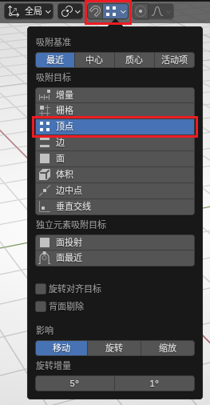
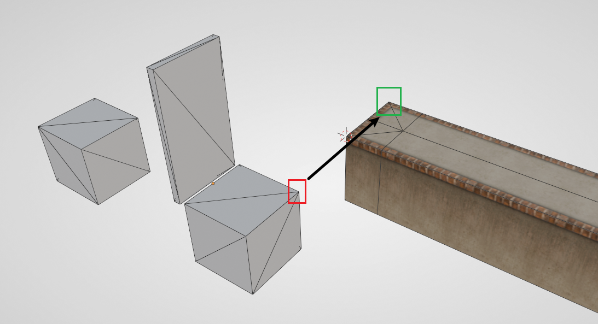
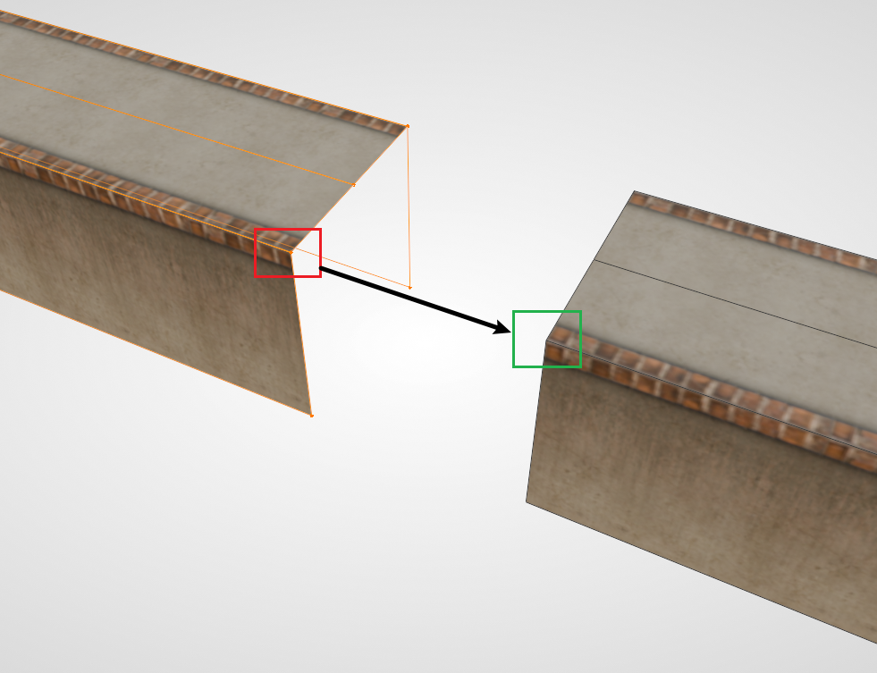

# Snapping Feature Explained

Blender comes with a powerful snapping feature that can be used for alignment, attachment, and other operations. In many cases, the snapping feature can effectively replace traditional object alignment, and is more efficient, intuitive, and easy to use.

## Enable Snapping

Find the snapping option at the top of the 3D Viewport, select **Vertex** in it, and select the magnet in the button. Selecting vertex snapping is because vertex snapping has the highest precision and is most commonly used in Ballance mapping. In special cases, you can also select "Edge" snapping.

Notice that the magnet in the image above is **not** selected. This is because Blender has a shortcut key to toggle whether snapping is enabled at any time. The default shortcut is `Shift + Tab`. It is recommended to enable it when needed, otherwise when moving objects (especially when moving vertices in Edit Mode), it will easily snap everywhere.

### Reference Point Mode

After selecting the object you want to move, first press `G`, then press `B`. At this time, you will enter **Reference Point Selection Mode**. In this mode, the object will not move. You can select any vertex in the scene as the **starting point** (including the point of the object being moved itself).

After selecting the starting point, the object will follow the mouse movement, and at this time you need to select a **target point** as the end point. The target point can also be any vertex in the scene.

### Quick Mode

When pressing `G` to move objects, you can hold `Ctrl`. At this time, Blender will automatically enable snapping, and the snapping method depends on your snapping function settings.

## Application Scenarios

### Aligning Modules

The object origin of some Modules is not at the geometric center of the Module, and the Module's placeholder model itself is not symmetrical. Using traditional methods to place Modules is a relatively troublesome thing, while using vertex snapping can complete the requirement in a very simple and intuitive way.

Take the push plate as an example. The end of the target Floor and the auxiliary block of the push plate should correspond completely, so you can directly use vertex snapping to get it done in one step.

### Extending Floors

Many times, when both sides of the Floor are ready, there may be a missing section in the middle. At this time, you can directly use vertices to extend one side of the Floor to fill it in.

The operation of dragging vertices while keeping the material normal requires the use of the auto-adjust UV function. For specific operations, see [Correct Face Attributes](../../tutorial/blender/sector-1#stretching-and-shrinking-floors).

