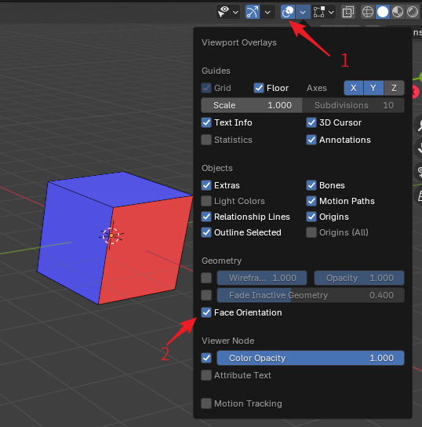

# Troubleshooting

This page records some common problems encountered during the mapping process. If you encounter problems not recorded here, welcome to [join the group to give feedback](../intro/introduction#community-support).

## Floors Turning Black

This problem mainly manifests as: viewing Floors in Blender and Virtools is normal, but in the game, large areas of irregular black appear.

Due to space limitations, this problem is covered in [Floor Blackening Problem](black-floor).

## Floor Shadow Anomalies

::: tip About the "Missing Shadow" Problem
Floor shadow problems used to be a problem that plagued the Ballance mapping community for a long time. The solution to this problem before the principle was formally discovered was to obtain objects from the original Level, then assign our object's mesh to this object. ~~Such repeated operations seem very stupid.~~

Ballance maps exported using BBP do not need to worry about shadow problems at all. As long as you group objects that need to show shadows into the Shadow group, you can get normal shadow display in the game. For other maps lacking shadows (referring to those that have already been grouped into Shadow but do not generate shadows), you can also simply fix them by importing them into Blender and then directly exporting them.
:::

Sometimes after merging Floors and exporting to the game, shadows may be abnormal, such as shadows appearing stretched and deformed, projected onto other objects, etc.

A simple solution is to select the Floor with anomalies, press `Ctrl + A` and apply `All Transforms`. At the same time, you can also check if the object has unapplied modifiers.

## Transparent Material Problems

Since Blender and Virtools material systems are not compatible, sometimes problems may occur such as "transparency is displayed correctly in Blender, but is opaque/blocks other objects/cannot correctly blend colors in the game".

For solutions, see [Material Texture: Semi-transparent Materials](texture#semi-transparent-materials).

## Transparent Texture Problems

Transparent textures in Ballance are a common visual rendering error problem. Different from the transparent material problem mentioned above, the transparent texture problem refers to images with transparent channels built into the game loading abnormally in the game.

A typical manifestation of the transparent texture problem is the **pillar continuity problem**. That is, the pillars created by the mapper in the game will look like they are cut, and you can see a clear cut outline, while the original pillars gradually extend into the background.

The pillar continuity problem used to be a problem that plagued the Ballance mapping community for a long time. The final solution to this problem before this plugin was released was through map-embedded scripts invented by chris241097. But this is quite troublesome for mapping beginners.

**By default, the pillars of Ballance maps exported using BBP are guaranteed to be continuous.**

The behavior of maps exported via BBP is closer to the behavior of the original Levels, that is, as long as they are opened and saved again through Virtools, the pillars will be broken. So if your map does not involve re-editing with Virtools (such as adding scripts, etc.), the exported map can be directly published for playing. If you use Virtools for editing, you must follow the tutorial written by chris241097, write map-embedded scripts, and modify the Video Format of the pillar texture file.

Similar to the pillar continuity problem, there are also problems such as the yellow glow of lanterns and the transparency of fan grids. These problems are the same as the pillar continuity problem. As long as they don't involve Virtools re-saving, you don't need to pay special attention to them.

::: info Trivia
The **pillar continuity problem** refers to the problem of "how to make pillars continuous", not "why pillars are continuous".
:::

## Collision Mismatch

After scaling a Floor, in the game, its collision box and visual model may not match.

Due to Ballance's underlying limitations, try not to scale objects that need to be physics-enabled (for example, objects grouped into `Phys_Floors`, `Phys_FloorRails`, and `Phys_FloorStopper`).

If you have already scaled it and need to keep the size, you can use `Alt + S` in Blender to eliminate the object's scale. Or press `Alt + A` and select **Apply Scale**.

## Flipping Faces

For performance considerations, Ballance will perform backface culling on most objects. Faces that are backface culled will not be rendered in the game, which is also one of the reasons for incorrect Level rendering. In short, the face flipping problem is particularly noteworthy in Ballance mapping. The following figure introduces the difference between the front and back of a face, and how to observe the front and back of a face in Blender:

To observe the front and back of a face, first open the Viewport Overlays in the upper right corner (shown by arrow 1. No need for Edit Mode, Object Mode is fine), then check the Face Orientation option under the Geometry category to open the Face Orientation display. After opening, the object will be covered with a blue or red mask. The blue mask means the normal points to the outside of the paper of the current view, and the red mask means it points to the inside of the paper, which is the so-called normal flip. Generally, you only need to observe whether red appears in the field of view, then use the menu `Mesh - Normals - Flip` in Edit Mode to flip its normal and correct it.

Ballance does not perform backface culling on all objects. You can force a specific face not to perform backface culling through materials. For example, the yellow light in the lamp posts of the original Levels does not perform backface culling. To not be backface culled, that is, to achieve so-called double-sided display, what needs to be done is to check the Two Sided option in the material of the face that needs double-sided display, then apply it. It should be noted that it is best to use an independent material for the part that needs double-sided display, because double-sided display may consume more drawing performance. If the whole map uses double-sided display, it may be very laggy.

By the way, Blender's material backface culling is synchronized with the Two Sided option in Virtools Material. Therefore, if you cannot observe a face in Blender, the probability is that you cannot see it in the game either. This can intuitively provide the mapper with a preview under backface culling.

## Stopper Has No Sound

See [Stopper Introduction](../basic/floor-and-rail#stopper).

## Project File Too Large

Generally, when BBP exports NMO files, it will only export the 3D objects you select, and will not produce useless objects. Generally, there is no situation where the NMO file is too large. ~~Unless you really stuffed a huge amount of content into it.~~

This refers to the Blender project file being too large. You can use the `Purge Unused Data` function in Blender's `File` - `Clean Up`.
