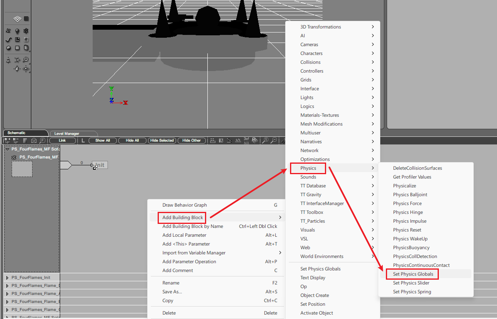
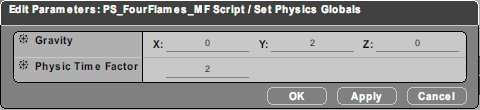
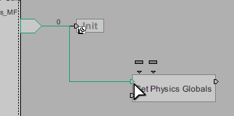

# Quick Start

This section demonstrates how to quickly insert and run a simple script in a custom map, without needing to understand the details of scripting.

## Preparation

First, download the basic tools. Making a script map requires the following tools:

| Tool                      | Author   | Notes                                                               |
| ------------------------- | -------- | ------------------------------------------------------------------- |
| Virtools 2.5 for Ballance | doyagu   | Used to edit scripts, essential                                     |
| Virtools documentation    | Virtools | No download needed — it is built into Virtools and explains most BBs in detail |
| Script Insertion Template.cmo | -    | A template for inserting scripts into a map, reducing your workload |

::: warning Note
Note that you should try to use **Virtools 2.5**, not the Virtools 3.x that is common in the Ballance community. This is because the 2.5 version recommended by this manual supports directly using Ballance's built-in special building blocks, and has a built-in script decryption feature, whereas 3.x supports neither, making it unsuitable for scripting mapping.
:::

For tool downloads, refer to [Resource Download Tips](../../mapping/intro/installations#resource-download-tips).

Then prepare any map that can be played normally (we recommend using an original map to experiment, or using Blender to quickly make a minimal playable map).

## Inserting the Script

First open Virtools, and in the top-left toolbar under `Resources - Import File`, import the map you prepared in advance, then check whether the map already has a script inserted. A simple method is: after importing the map, find the `Schematic` tab. If it is blank, then the map has no script inserted.

::: warning Hint
The reason you need to check in advance is that if you open a map made via the **Linen 3ds Max mapping workflow**, the map should already come with several scripts. These scripts function similarly to the script insertion template, so there is no need to insert a script again.

**If that map already has a script inserted**, there is no need to insert one again — **you can skip this step directly**.
:::

From the top-left toolbar, select `File - Merge Composition...` to import `Script Insertion Template.cmo`.

::: tip Hint
If a popup prompt appears during import, it is generally because a material in the template shares its name with one in the map. There is no need to worry — choosing either `Replace` or `Ignore` is fine.
:::

After a successful import, look at the `Schematic` tab again. Some editable areas should appear, where we will write some simple scripts in the next step.

## Writing the Script

Right-click an empty area of the script, then choose `Add Building Block - Physics` in turn to add a `Set Physics Globals` building block. This building block can set the physical constants of the physics engine, such as the gravity vector and the physics simulation rate.

After adding the building block, you can start setting its parameters. Double-click the building block to enter the parameter settings interface. We set the Gravity to `0, 2, 0` and the Physics Time Factor to `2`. This makes gravity point slightly upward.

::: tip Common Knowledge
Ballance's default physics simulation rate is 2, which you can think of as the game's physics engine defaulting to a 2x speed. Setting this to 1 gives you a Ballance map that runs at 0.5x speed.
:::

Then connect the entry point of this building block to the script's entry point. The script's entry point is the arrow on the left; we need to connect it to the first input port on the upper left of the building block.

::: warning Each port has a different purpose
A common misconception among newcomers is thinking that the first input port on the left of a building block is the start port. In reality, each port is responsible for starting a different piece of logic. Before using one, you can hover the mouse over a port to view its name.
:::

Hold down the script's entry point, drag it onto the building block's input port, and release. Connecting in the reverse direction works the same way: left-click and hold the building block's input port, then drag it onto the script's entry point. When a connection is possible, the connection line shows green; release the mouse then to complete the connection, and the line turns back to black.

## Export and Run

The way to export a script map is slightly different from basic mapping, but you can also use the ordinary export method. In the `Level Manager` tab, right-click `Level`, choose `Save as...`, and save it as an nmo file.

Enter the game, and you will see the effect of gravity now pointing slightly upward — the ball and props will slowly float upward.

::: warning Note
**An nmo file saved with `Save as` will lose its IC information.**

Although this section's tutorial does not use IC, if you assign IC to certain objects while writing your script, save the project directly as a cmo (either press `Ctrl + S` or choose `File - Save Composition` from the menu bar), then manually change the extension to nmo, and import it into the game to play.

For a detailed explanation, see [Initial Conditions](basic-concepts#initial-conditions).
:::

## Further Learning

Next you can learn about the [Script Insertion Principle](scripts-insertion) and the [basic concepts related to scripts](basic-concepts). You can also learn some [basic operations](basic-operations) related to Virtools scripts.

After learning the basics, you can use the table of contents on the left to look up what you want to learn in a targeted way. We strongly recommend mapping with a goal in mind, rather than blindly trying to finish all the tutorials before starting to map — doing so also goes against the original intent of this manual.
