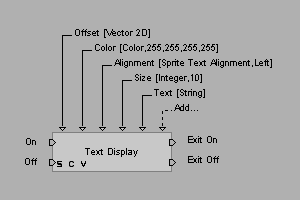

# Building Block Overview

A building block is called a **Building Block** in Virtools, abbreviated as **BB** by the community.

A BB is one of the smallest units in a script. It represents a **function**, and it can provide multiple execution methods as well as parameter inputs and outputs.

## Inputs and Outputs

A BB can correspond to four types of inputs and outputs:

- Logic input (located on the left side, always present)
- Logic output (located on the right side, not necessarily present)
- Value input (the upper triangles, not necessarily present)
- Value output (the lower triangles, not necessarily present; note: there is no value output in the figure above)

When **any input port** on the left side of a BB is activated, the BB will read parameters from the **value input ports** above it, then execute the corresponding function (generally one input port corresponds to one specific function). After execution, it places the result of the execution at the **value output ports** below (if any), and then activates the **logic output ports** on the right (if any).

::: warning Note
Input and output ports do not correspond to activations in a strictly one-to-one manner. Although in the example below, `On` corresponds to activating `Exit On`, and `Off` corresponds to activating `Exit Off`, this does not mean that all BBs have this kind of correspondence. You should write scripts according to the names of the input and output ports and the documentation (if any).
:::

## Example

For example, the figure below shows the documentation and schematic of a BB named `Text Display`, whose purpose is to display text on the screen:

In this example, if `On` on the left is activated, the BB will read parameters from above and display the text on the screen.

There are 5 parameters in total, corresponding one-to-one with the value input ports in the figure, as shown in the following table:

| Parameter | Type      | Description        | Default                |
| --------- | --------- | ------------------ | ---------------------- |
| Offset    | Vector 2D | Position           | `(0, 0)`               |
| Color     | Color     | Color              | `(255, 255, 255, 255)` |
| Alignment | -         | Alignment          | `Left`                 |
| Size      | Integer   | Font size          | `10`                   |
| Text      | String    | Text to display    |                        |

After execution, the `Exit On` port on the right will be activated. If it is connected to the next BB, then the corresponding input port of that next BB will be activated.
