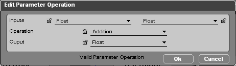

# OP

OP stands for Operate Parameter. It is the way to operate on variables in vt, generally used to perform a calculation on 1~2 variables and obtain a result. You can obtain different results by setting different operation modes, as long as the operation and the variable types are compatible.

## Types

OP is divided into two types:

| Type          | BB                                              | Parameter Operation                                          |
| ------------- | ----------------------------------------------- | ------------------------------------------------------------ |
| When to calculate | Calculated when the BB is triggered          | Calculated when needed downstream                            |
| How to add    | Same as adding other BBs                        | Right-click menu `Add Parameter Operation` or press the shortcut `Alt + P` |
| How to configure | Right-click `Edit Settings` or press the `S` shortcut while selected | Configure directly when creating or left double-click  |

## Configuration

The OP configuration interface is as follows:

The main logic of an OP is: use the two variables from `Inputs`, through the operation method of `Operation`, to obtain the result in `Output`. For example, the configuration in the figure means adding two `Float` values together to get a new `Float` value.

## Type Compatibility

The operation method and variable type must be compatible, otherwise the operation cannot be performed. For example, you cannot add a `Vector 3D` and a `Float`.

The way to judge whether it is feasible is simple: if the operation cannot be performed, the `OK` button will not appear on the configuration page.

::: tip Hint
To find the operations supported by a certain type, or to find the types supported by a certain operation, you can use the 🔒 **lock button** on the configuration interface. After locking part of the configuration, the remaining configuration will adapt automatically, and the dropdown options will only show the available types.
:::

## The None Type

Some operations may only need one input variable to proceed, for example `Get Position` only needs to be given a `3D Object`. But an OP has two input variables by default. In this case, to configure correctly so that the `OK` button appears, the other input variable can be set to `None`, indicating that this variable is not used.
