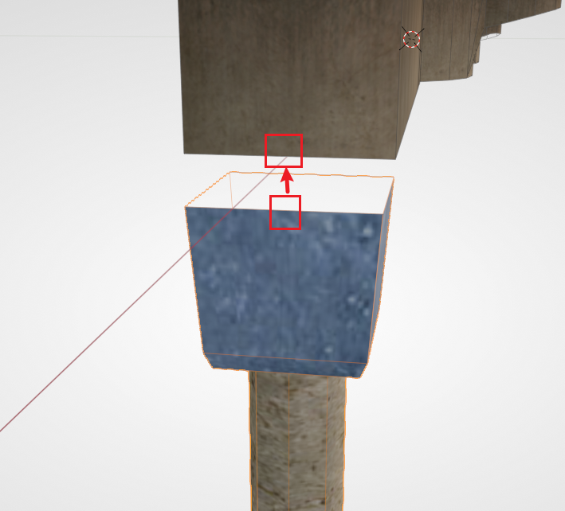
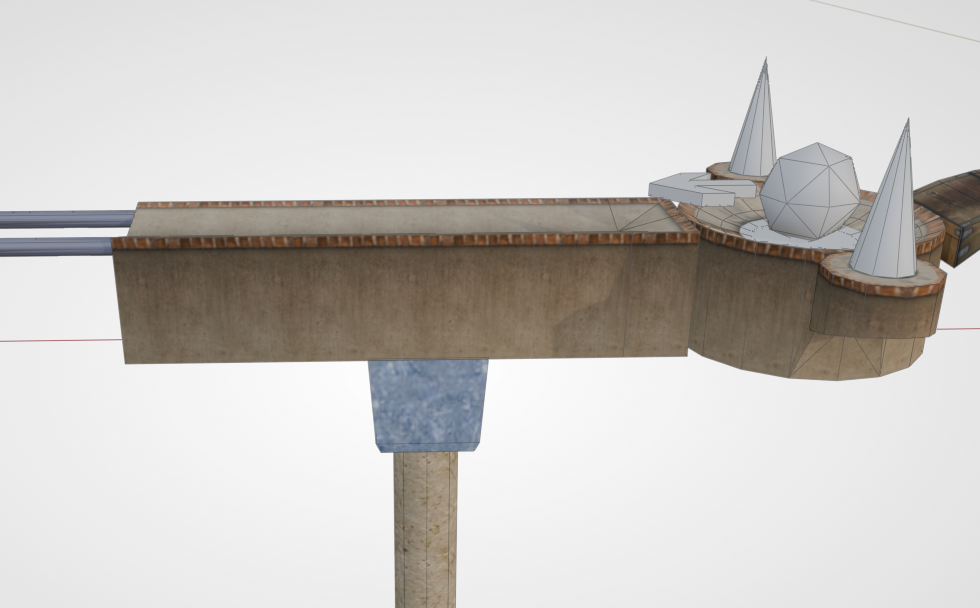
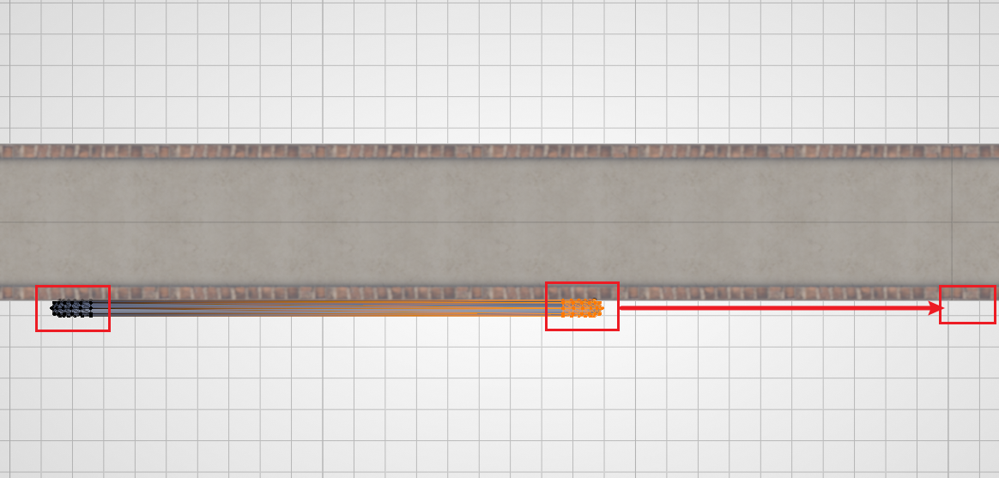
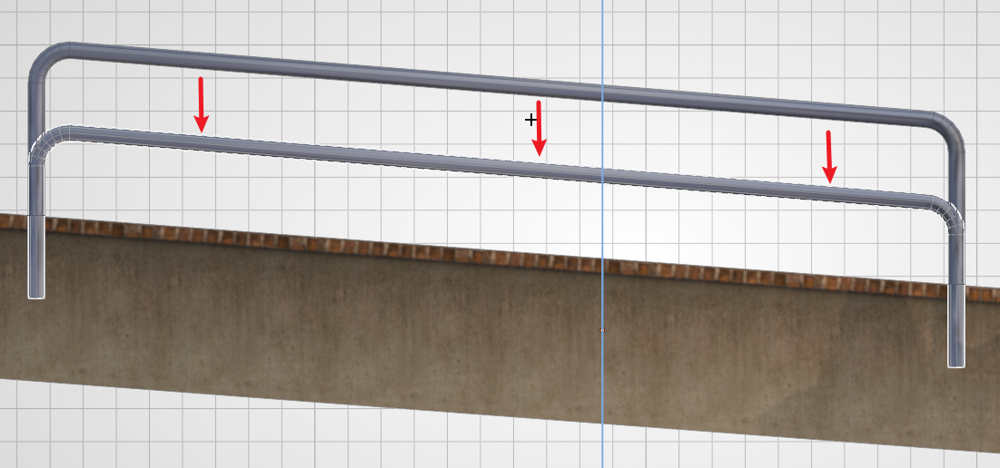
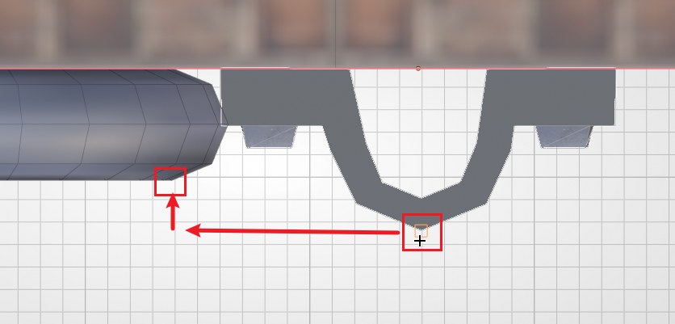
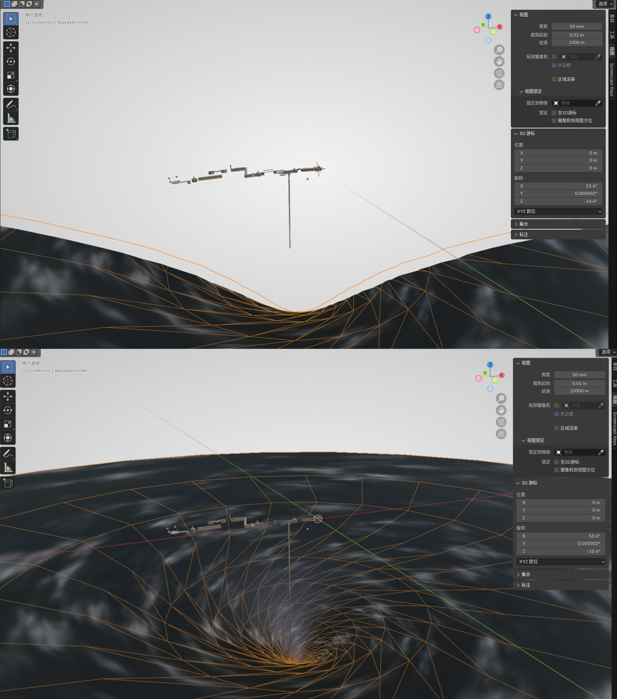
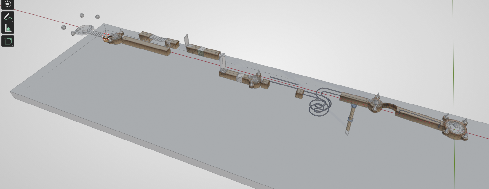

# Decorations and Depth Test Cube

The elements introduced previously can be used to make a playable level, but a good level also needs some decoration. This chapter's content introduces the common decorations in Ballance, as well as the application of the death zone.

## Columns

Columns can be seen everywhere in the original levels. Columns are used not only to support floors (the support is actually a purely visual effect — obviously the floor will not fall down by itself), but you can also assemble a streetlight on top for decoration (decoration only, it does not emit light). And the length of a column is actually limited; the cylinder at the bottom uses a gradient transparent texture, so that in the game it looks as if it extends all the way down to the ground.

::: tip Advanced Tip
In the past mapping workflows, due to Virtools compatibility issues, the columns we placed easily exhibited a **faulting** phenomenon. This is actually a texture parameter failure in the game, which prevents the column from correctly recognizing the gradient texture. The same failure also applies to the yellow halo in the streetlight, the lamp shadow, and so on. But Blender mapping directly generates NMO files corresponding to Virtools 2.1; if you don't save them a second time with Virtools, the above problems generally won't occur. See: [Column Not Breaking Problem](../../mapping/blender/trouble-shooting#transparent-material-problems).
:::

The asset library provides columns, columns with a streetlight, and standalone streetlights. Among them, the placement of streetlight columns has no strict specification; you can just refer to the original, or place them wherever you like.

As for the columns used to visually provide support, they are recommended to be snapped to the underside of the floor, as shown in the figure below. The snapping used in the figure below is **midpoint-to-midpoint snapping**.

You can then slide it to any position. There is actually no specific specification for the position either; it just needs to look reasonable.

## Guardrails

Guardrails are likewise everywhere in the original, but the difference is that placing guardrails is much more troublesome than placing columns (this may also indirectly lead to many rough custom maps not wanting to place guardrails).

A guardrail is composed of two parts: a **rail** and a **rivet**. The difference between a guardrail and an ordinary rail is that the diameter of a guardrail is smaller, making it look thinner; apart from that, all its other properties are exactly the same as a rail.

Below we use a section of straight guardrail to demonstrate. First we drag a guardrail rail out from the asset library. Switch to the top view, attach the guardrail to the roadside, then enter Edit Mode and drag the vertices on both sides to the positions you want.

Then switch to the side view and align **the bottom of the guardrail** with **the top of the floor**. The figure demonstrates a slanted surface, so the alignment uses Edit Mode, performed in vertex mode. After aligning, move the guardrail down by `2.5`.

Then add a rivet, and likewise attach it to the roadside. Then **constrain the movement** to the **floor extension direction**, and use vertex snapping to align the guardrail and the rivet. As shown in the figure below:

Finally, following the guardrail, drop it from the top of the floor by `1.25` (generally half of the rail drop height).

::: tip Hint
Because the drop heights of the guardrails and rivets in the original game **are not precise** (most likely they were placed casually), the values given in this tutorial **are for reference only** — they are just values measured from the original that are relatively **average** (and easy to remember). If the mapper does not want to be so precise, or has their own design, they can decide the drop height themselves.
:::

## Cloud Layers

There are two kinds of cloud layers in the original game:

- The ordinary cloud layer for levels 1 ~ 11
- The vortex cloud layer for level 12

Both kinds of cloud layers are provided in the asset library; generally you just need to place them out. The height of the cloud layer can be decided according to the situation. Generally, during play, you should not be able to see the edge of the cloud layer (it is very unaesthetic).

It is worth noting that cloud layers are generally very large. When we place them in Blender, if we zoom out the view, we will find that the cloud layer can only display a part, or when pulled far enough away it simply does not display. This is because Blender's view sets the default maximum view distance to `1000`. Changing it is also very simple: just press `N` in the view, then find the "View" tab, and change the **End** of the view to a larger value (for example `10000`). Below is a comparison before and after the adjustment:

Cloud layers can very much affect the editing of other objects; it is easy to accidentally select them or make the background look messy. And a hidden cloud layer can still display normally in the game. So it is recommended that after placing a cloud layer, you can just hide it directly. Select the cloud layer and press `H`, or in the Outliner (the area in the upper right of Blender's default view) click the eye symbol corresponding to the cloud layer object, to hide it.

## Death Zone

A death zone is an object used to kill the player's ball and reset it, because after the player drops the ball, if they don't touch a death zone, there's no way to ever come back up.

Creating a death zone is very simple; you only need to use the cube built into Blender. After `Shift + A` creates the cube, we switch to the top view, then press `G` to move it to roughly the center of the map. Then press `S` `X` and `S` `Y` to scale it up until it covers the entire bottom of the map. Then we switch to the side view, press `G` `Z` to move it down to an appropriate position, so that the ball can only possibly hit the death zone when it falls off the floor. The final result is roughly as follows:

A death zone does not need to be displayed to take effect in the game either, so we likewise need to hide it (otherwise you would be able to see these huge cubes in the game).

::: tip Hint
If your map spans too much (whether horizontally or vertically), it may be better to use several smaller death zones than one giant death zone.
:::

::: tip Death Zone Detection
The detection method of a death zone is the bounding box. So don't try to use a complex mesh / rotated mesh to make a special-shaped death zone. If you really need a special shape, you should create multiple death zones to achieve a similar effect. See [Death Zone](../../mapping/basic/depth-test-cube).
:::
