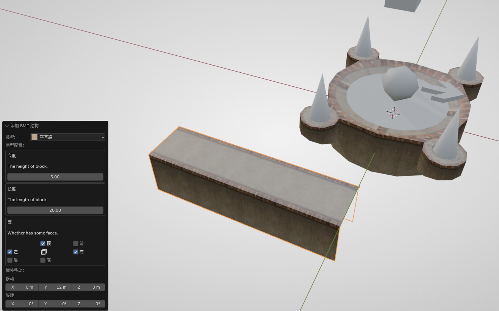
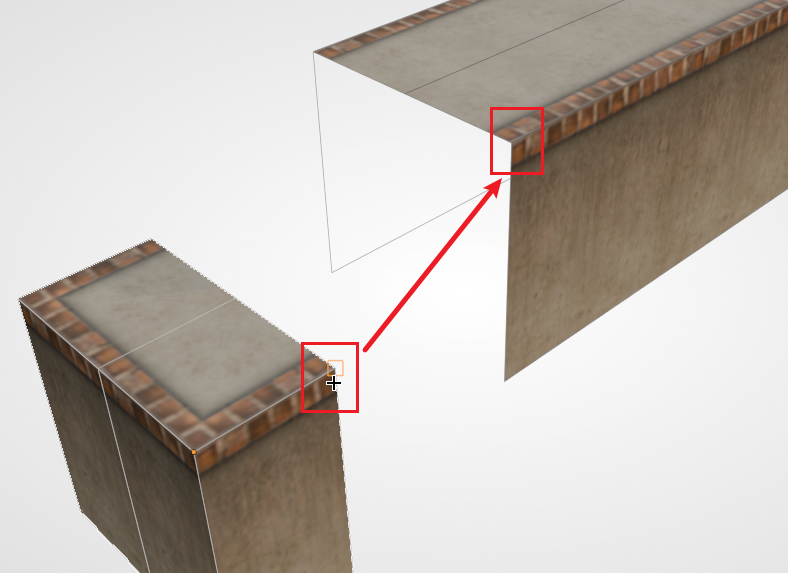
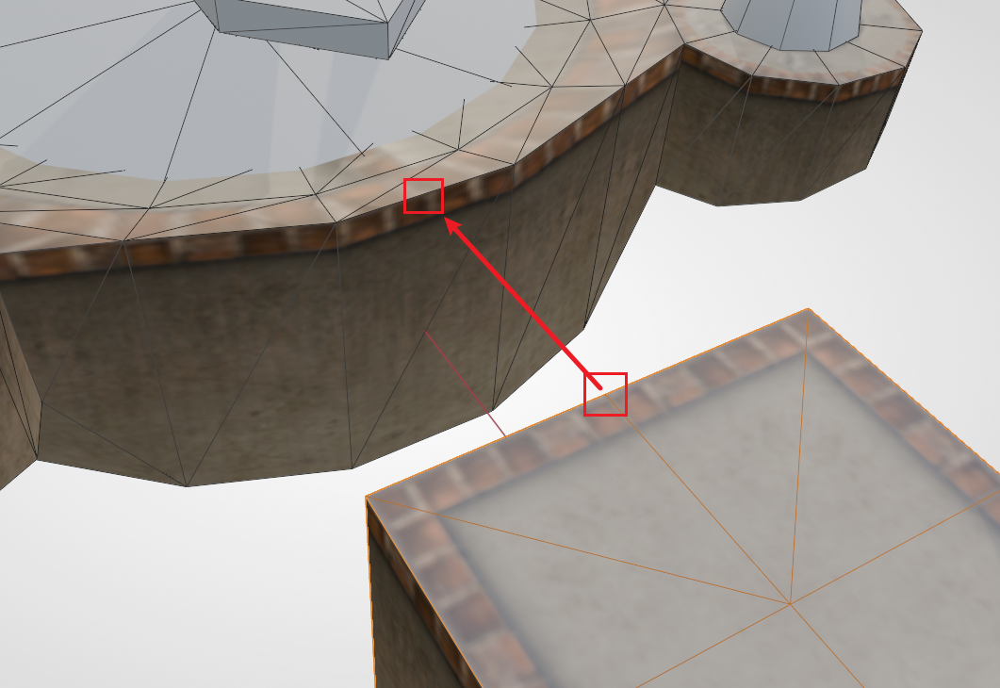
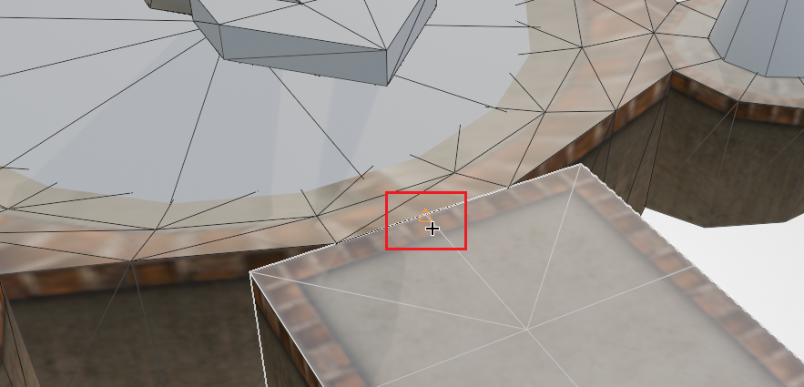
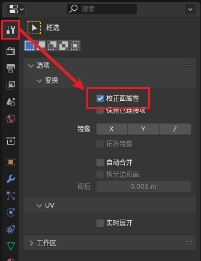
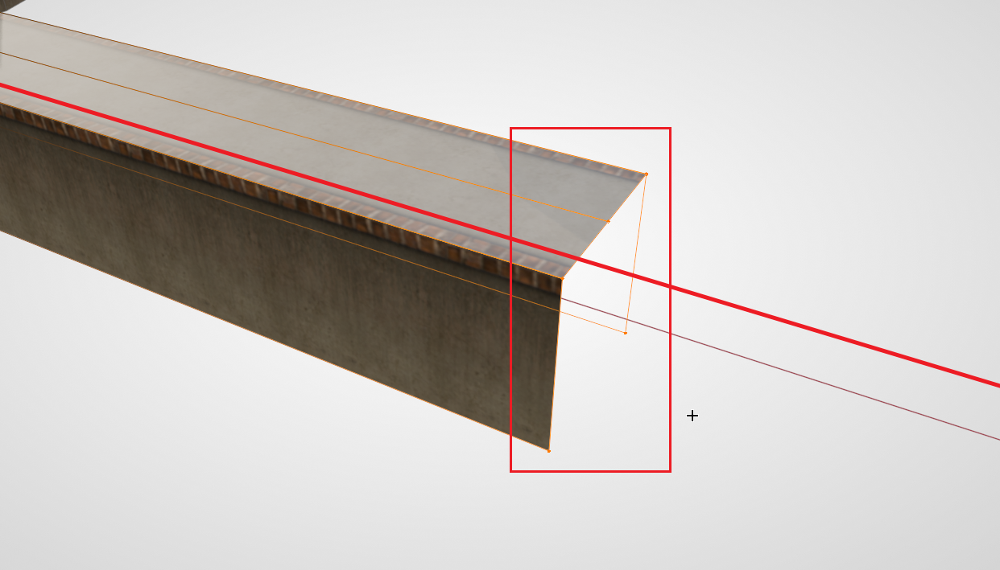
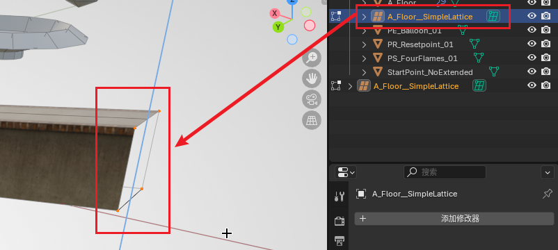
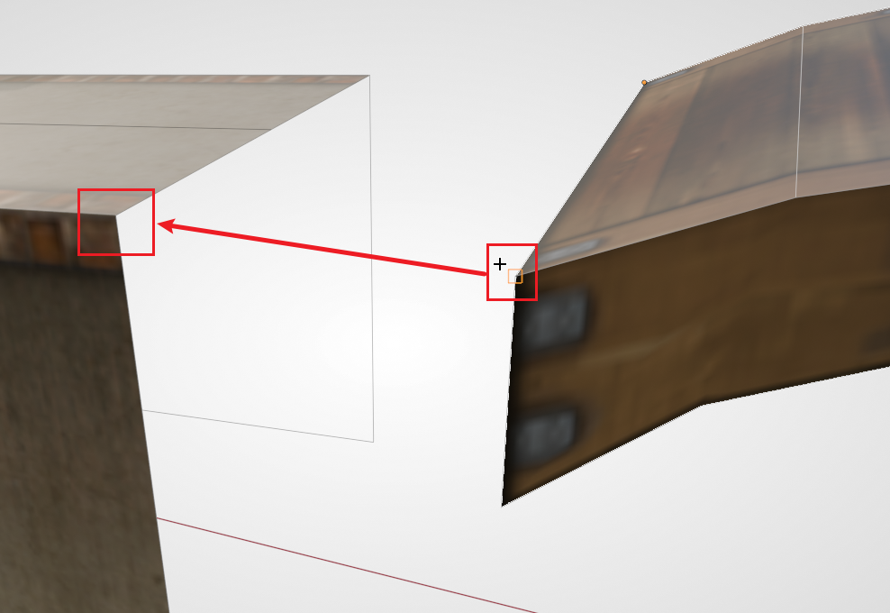
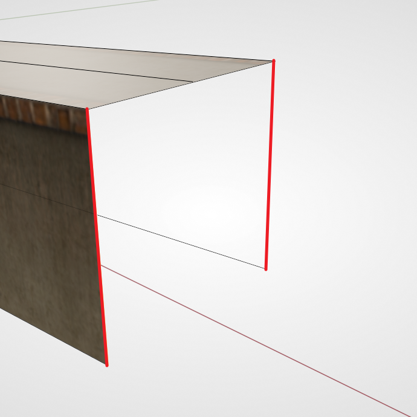
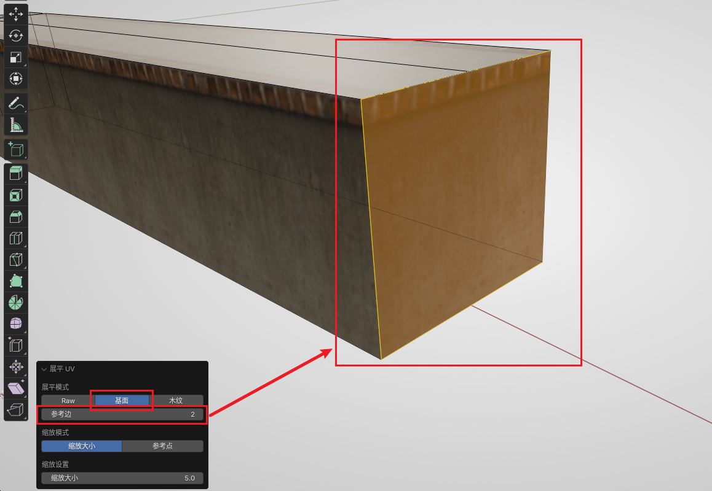

# Sector 1: Assembling Floors

In this section we will demonstrate how to make original-style floors in Ballance.

When mapping, the most basic and most commonly used floor-making method is assembling. Much like putting together a jigsaw puzzle, we use basic blocks such as straight sections, corners, and junctions to assemble complex roads.

## What Basic Blocks Are There

First we need to distinguish the several kinds of roads that generally exist in the Ballance original style:

- Flat floor: the most common, a floor with a width of 5.
- Wide floor: a wider floor, with raised protective edges on both sides. For example, the start of 1-1.
- Concave floor: a floor with a depression in the middle.
- Thin-edged patterned floor: generally used for large platforms whose edges have raised protection.

Each type of floor has several basic structures:

- Straight section
- Corner
- T-junction
- Cross junction
- Straight section end

In addition, there is a special one, used between flat floors and concave floors: the flat-to-concave transition floor.

After a preliminary understanding of the various floor types, let's get hands-on and make a section of floor.

## Adding a Flat Straight Floor

BBP has already provided the basic structures of all the above floors for us. Let's try to generate a section of flat straight floor. **First move the 3D cursor to a relatively empty position**.

::: tip Hint
Hold down `Shift` and click the **right mouse button** to quickly change the position of the 3D cursor.

By default, your 3D cursor is located at the world origin. Since objects are added at the position of the 3D cursor by default, directly generating a floor would have it obscured by the checkpoint floor placed at the origin in the previous sector, which makes it inconvenient
to observe and select. Always remember to make good use of the 3D cursor!
:::

Press `Shift + A` to generate a section of flat straight floor (Normal Floor). Before performing any other operation (including "moving"), first observe the dialog box at the lower left. In the dialog box you can choose the height and length. By default, keeping the height at 5 is fine; the length can be set freely, and there are also ways to modify it later.

Also note that there is a "Faces" parameter below, which controls whether each face of the floor is generated. For example, for a flat straight floor, by default only the top face and the two side faces are generated; all the other faces are empty. This is to save map size and in-game rendering overhead — **when mapping it is customary to delete faces that the player can never see**. The front and back of a flat straight floor will generally connect to other floors, so there is no need to create faces. Of course, in some situations the front and back faces will also be exposed. At that time, you can use the "Faces" parameter to fill them in during generation, to ensure a normal visual effect.

Here we create a section of floor with a length of 20 (without filling the front and back faces) and set it aside.

## Floor Assembly

Floor assembly is the main operation in constructing floors. Let's first try it out in a practical application scenario.

Currently, both ends of the long straight floor are empty. Let's try adding an end structure to one of them. First add a flat straight floor end (Normal Floor Terminal), keeping its default generation options.

Then select that end structure, press `G` `B`, select a vertex at the opening, and snap it to the corresponding vertex at the opening of the flat straight floor, as shown in the figure below:

::: tip Hint
For the convenience of demonstration, the figure above has wireframe overlay display enabled, which is **not** entering Edit Mode. Remember that **the alignment of objects** must always be done in **non-Edit Mode**. In the subsequent figures, unless it is **explicitly noted** that you need to enter Edit Mode, the operations are generally performed in Object Mode.
:::

Then you should be able to notice that these two structures have already fit together perfectly. After deselecting, no object seams should be visible. Of course, on the floor material there **may** be subtle seams. In this kind of situation, since they are generally hard to see in the game, we don't need to do anything about it.

Since at this point the two structures are merely adjacent and touching, you might want them to be truly merged into the same object. This is also easy — just select them all, and then press `Ctrl + J` to merge them. But note that here we merge the floors only for convenience, to be able to move multiple floor structures at once. In fact, although these floor structures have been merged into one mesh, they are still **each independent**. You can leave this point aside for now and not worry about it; when this tutorial does its overall finishing work, it will show how to truly merge meshes together.

## More Snappable Points

At this point our floor is placed independently of the checkpoint. Now we need to align the floor with the checkpoint. If you have used alignment in 3ds Max before, you might be inclined to use "center-to-center" to ensure the two are aligned along the axis direction, and then use "max-to-min" to ensure the floor terminal fits against the checkpoint. In fact, we can just continue to take advantage of the powerful snapping feature.

First rotate and move the floor from just now, so that its general direction and position correspond to the checkpoint. Then select the floor, press `G` `B`, select the **midpoint of the top edge** at the floor end, and then snap it to **the midpoint of the outer top edge** of the checkpoint. As shown in the figure below:

When correctly snapped to the midpoint of the top edge of the checkpoint, it should display as shown in the figure below (i.e. a **triangle marker** appears at the midpoint position):

If you successfully completed the above operation, then you have already learned how to make floors. You can follow your own ideas and make a few more floors for practice.

## Stretching and Shrinking Floors

Suppose you have already generated a section of **flat straight floor**, but for some reason you feel that the length is not enough (or is too long), and you want to adjust the length of the floor again. At this point there is no longer a BBP dialog box for you to adjust the length, and you might think of the scale operation, only to find that the floor's material will also be stretched, with a very poor visual effect. In fact, there is no need to create an additional section of floor; you can directly lengthen the mesh itself by moving vertices.

First we press `Tab` to enter Edit Mode. Note that by default, stretching the mesh will also stretch the floor's material; we need to enable the **Correct Face Attributes** feature. Once enabled, Blender will automatically correct the UV for us, so the material will automatically extend instead of being violently stretched. The toggle is located in the tool panel at `Options - Transform - Correct Face Attributes`. As shown in the figure below:

::: tip Hint
Can't find the **Correct Face Attributes** toggle? You have to be in **Edit Mode** first for this toggle to appear.
:::

Then start operating on the vertices. **Press `Alt + Z` to enable X-Ray mode**, select all the vertices on **the end with the gap**, then press `G`, constrain an axis (the red line in the figure below is the constrained X axis), and drag the vertices along the axis.

::: tip Hint
Be sure to enable X-Ray mode before selecting vertices. Because of the nature of the structures created by BME, there may be multiple vertices located at the same position. Not enabling X-Ray mode will result in an incomplete selection, and you won't be able to drag the entire end face completely.
:::

## Making a Slope

In Ballance, the track is not always located at the same horizontal height; slopes are very common. Below we will demonstrate how to make a slope.

For an ordinary **straight floor**, making a slope is very simple. Because its middle line is determined solely by the vertices at both ends, following the method of stretching and shrinking a floor described above, select the vertices at one end, and then constrain the movement to the Z axis.

But sometimes, the middle straight line is not entirely determined by the points at both ends (i.e. there may be other segments in the middle, for example the floor with an end face that we combined together not long ago). In this case we need to use a more advanced method to form the slope; the most commonly used method is FFD (lattice deformation).

::: tip Hint
Lattice deformation is a commonly used deformation technique in modeling. It can map a complex mesh onto a simple cubic mesh, and editing the lattice's mesh will pass each vertex's displacement on to the target mesh. Here we apply lattice deformation to a floor in order to evenly transmit the slope's change when making the slope, so that the floor can remain a straight line after deformation.
:::

Because Blender's built-in lattice is not very convenient for Ballance mapping ~~(in fact it's quite constipating)~~, here we recommend using a plugin called Simple Lattice (see [Tools Installation and Configuration](../../mapping/intro/installations)). After installing and enabling the plugin, right-click the floor, and choose `Simple Lattice Create` from the menu. At this point the plugin will do several things:

- Create a lattice based on the selected object's bounding box
- Bind the selected object to this lattice
- Enter the lattice's Edit Mode

Generally, when we make slopes there is no need to set additional lattice subdivisions, and the interpolation type can remain linear. You can explore the richer FFD parameters on your own. At this point, select the points at one end (at this point you should be in the Edit Mode of the lattice, not the Edit Mode of the object), then move them upward, and you can see the slope effect.

Generally, we can keep this lattice so that we can continue to adjust it later. If you are satisfied with the slope, you can fix the current state. The operation method is as follows: first remember to exit Edit Mode, then select the object, find its modifier panel, and you should see a `SimpleLattice` modifier. Select that modifier and press `Ctrl + A` to apply the modifier. After it is applied, the mesh will be fixed to its current state. At this point the lattice created by Simple Lattice can also be safely deleted.

## Filling Faces

We notice that the floor still has a face with a gap. If we assemble other floor blocks such as junctions, flat-to-concave transitions, or directly assemble a road-end structure, this face will be blocked, and we won't need to fill it in. But there are also many times when we need to fill this face directly, instead of assembling a new end.

Suppose we want to connect a small arch bridge behind this position. Following the original map style, this face should be filled with a side-face material. First we drag a small arch bridge out from the asset library, and use the snapping feature to assemble the floor and the arch bridge together.

You can find that, at the connection, because the floor is not occluded and the missing face is exposed, it looks very ugly. At this point we use Isolate mode to edit the floor alone. Select the floor and press `/`, which temporarily hides other objects (press `/` again later to return to normal mode), letting us observe only the floor. Enter Edit Mode, press `2` to switch to **Edge Mode**, then select the two **side edges** of the gap, as shown in the figure below (the red lines in the figure are the two edges to be selected):

Then press `F` to create a face. At this point you should be able to see a rather blurry side face filled in. Now keep this face selected (or switch to **Face Mode** and re-select this face), and then open the **Flatten UV** feature in the **Ballance menu**. Note the dialog box in the lower left; we need to choose the flatten option dedicated to floors (the second one in the first row), and then adjust the reference edge (for a quadrilateral face, just try 0, 1, 2, 3) until the pattern on our side face looks reasonable. This fills in a face.

You can also use the same method to fill in faces for the small arch bridge we just dragged out.

## Next Up

You can create some floors on your own and build structures such as mazes and bridges. Once you are proficient with floor operations, you can move on to the next sector: [Sector 2: Building Rails](sector-2).

In addition, in addition to the assembly method above, we also have more advanced ways to create floors, such as [Sampling Floors](../../mapping/blender/sampling-floor).
