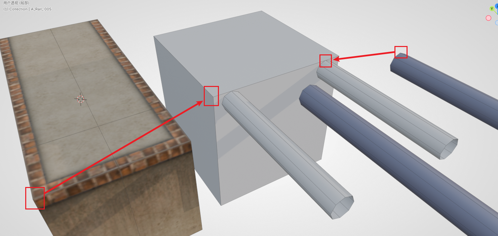
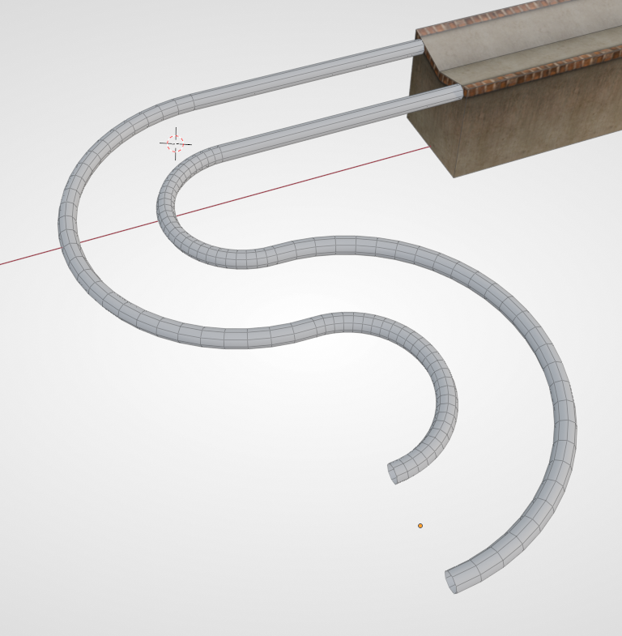
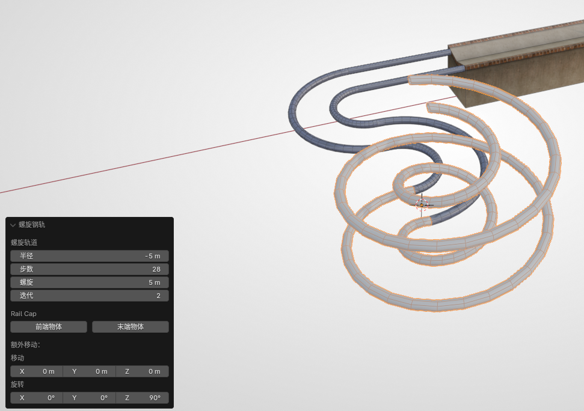
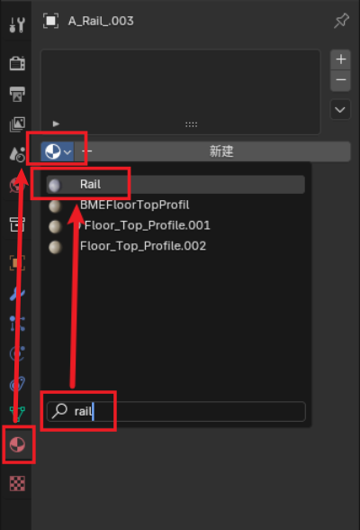

# Sector 2: Building Rails

In this section we will demonstrate how to make original-style rails (also called tracks) in Ballance.

When making rails, compared to ordinary floors, there is more flexibility. In addition to straight sections and curves, there are also many variants such as side rails, spirals, side spirals, and free tracks. This chapter's tutorial will explain them one by one.

## Straight Rail Alignment

BBP provides several basic rail structures. First we add a section of straight track, whose function is similar to that of an ordinary straight floor. You can also try the various operations of ordinary floors on rails (such as lengthening, assembling, filling faces, etc.), which we won't repeat here.

Here we introduce how to align rails with floors and so on. Since rails do not have a 5x5 mesh like floors, you cannot directly use snapping for alignment. Below is an alignment approach.

- First move along the rail direction, attaching the rail to the floor.
- Then comes the alignment in the cross-section direction. Generally, a rail not combined with other objects and a straight floor not combined with other objects can be aligned using the "center-to-center" mode in the max alignment tool.
- Finally, move along the Z axis to align the top surface of the rail and the top surface of the floor. (If it is a concave floor, align it with the top edge, as shown in the animation below)

If **the floor and the rail are rather complex** and max-style alignment cannot be used, you can also use the above method to make an auxiliary alignment object (as shown in the figure below), then make **the block part overlap with the floor** (using vertex alignment), and then **align the rail vertices to the auxiliary rail**, and finally remove this auxiliary object. ~~If you're being lazy you can also just eyeball it (x~~

Another way is to enter Edit Mode, select the face to be aligned, and then **move the 3D cursor to the selection**. Later you can move the object's origin to the 3D cursor, so that you can also use the max alignment tool for "pivot-to-pivot" alignment. There are very many specific approaches, and it is impossible for the tutorial to list them all; the reader should judge for themselves and apply them flexibly.

## Side Rail Introduction

The parameters of a side rail are relatively simple, but there is one special parameter, namely the side rail type.

- Ordinary: a general side rail that only allows the wood ball and the paper ball to pass.
- Stone ball exclusive: a larger tilt angle, so that the stone ball can also pass.

Its other parameters are no different from an ordinary rail, so we won't say much more.

## Curved Rail Introduction

Curved rails have a few more parameters, of which the more important ones are explained below:

- Single rail / double rail: the type of track to create.
- Radius: the radius here refers to the distance between the rail's central axis and the origin (it is more obvious if you choose to create a single rail).
- Steps: Ring-shaped objects are also composed of polygonal faces. The higher the number of steps, the more faces there are in this section of track, and the smoother the track will appear, but it will also more easily cause game lag, physics bugs, and so on.
- Angle: refers to the central angle corresponding to the arc of the rail. 90 degrees is a 1/4 circle arc.
- Front/Back object: automatic face filling. If nothing is connected at the front or back, you can check these two options, and BBP will fill the faces in for you.

The figure below is made by assembling two curved rails with a radius of 5 and an angle of 180 degrees. (The straight track connected to the concave floor is not part of the curved rail)

## Spiral Track Introduction

BBP also provides the most common spiral track, which can be generated simply by filling in some parameters. The creation parameters of the spiral track are explained as follows:

- Radius, Steps: see the parameter explanation of the curved rail above. In particular, a negative radius will create a reverse-direction spiral.
- Spiral height: the height each layer of the spiral climbs.
- Iterations: can be simply understood as the number of layers.
- Front/Back object: automatic face filling.

There is also a kind of spiral track, called a side spiral, because it is similar to a side rail, only allowing the ball to stick to the side of the track. Its principle relies on the ball's centrifugal motion to keep the ball from falling off (in fact most of it is the force from the player's input). The parameters of a side spiral are quite similar to those of a spiral track, so the reader can explore them on their own.

::: tip Advanced Tip
Examples of spiral tracks in the original include the stone ball spiral at the start of 9-1 and the stone ball roller coaster and the wood ball reverse-up spiral of 13-5. For some tracks that have appeared in the original, there are ready-made models in the asset library that can be applied directly.

When mapping technology was just getting started, you could only use Virtools and existing floor blocks to assemble things, or due to technical limitations, you didn't know how to make spirals and fancy tracks. So there was no choice but to use the original tracks.

But for the latest mapping technology we are using now, **simply applying** the original tracks would look rather perfunctory and meaningless ~~(unless you're doing an old trick anew)~~. So generally, try to make the unique tracks that belong to your map yourself. For making any kind of fancy track, you can refer to [Sampling Rails](../../mapping/blender/sampling-rail).
:::

## Rail Material

You may have already noticed that rails are created with no material by default, and will appear as gray models in Blender. BBP has a material-assigning workflow, which is rather complicated and requires understanding concepts such as Virtools materials. We can use the simplest and quickest way, namely: take any rail (a guardrail will also do) out from the asset library. At this point your Blender project will have a material named `Rail`. We only need to simply search for it and add this material to the rail. Then this guardrail can be deleted.

To present the same visual effect as the original in Blender, we keep the rail selected, then find the **Rail UV** item in the Ballance menu. In the popup dialog box, fill in the same `Rail` for the material as just now. This tool can automatically distribute the UV for the rail, making the rail look more like it does in the game (the rails in the game are smoothed, so there may still be slight differences).

## Next Up

Having understood the basic rail making, we can start to understand how to place mechanisms. Start reading [Sector 3: Placing Modules](sector-3).

In addition to the several most common basic rails provided by BBP, we can also use the sampling method to make fancy rails. See [Sampling Rails](../../mapping/blender/sampling-rail).
