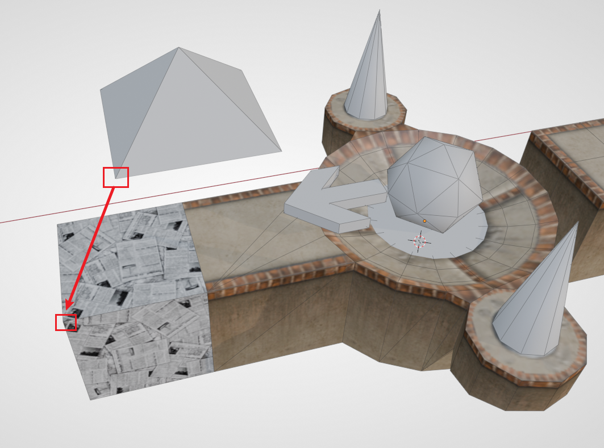
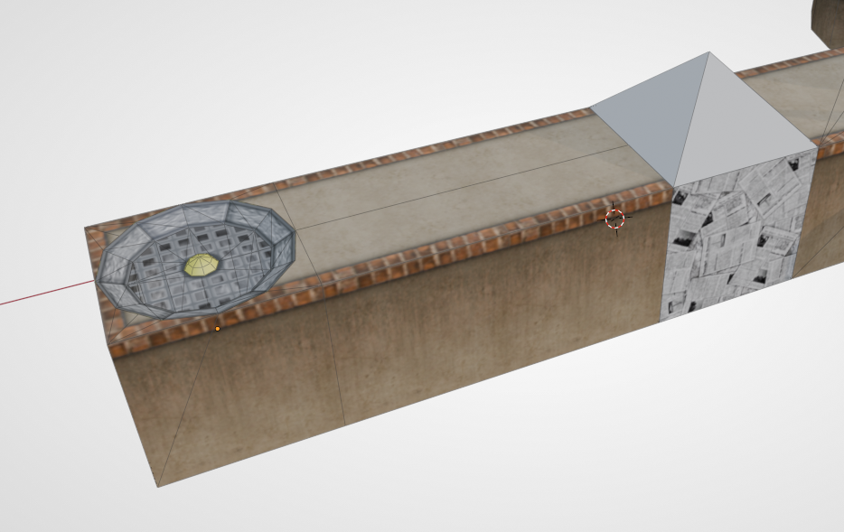
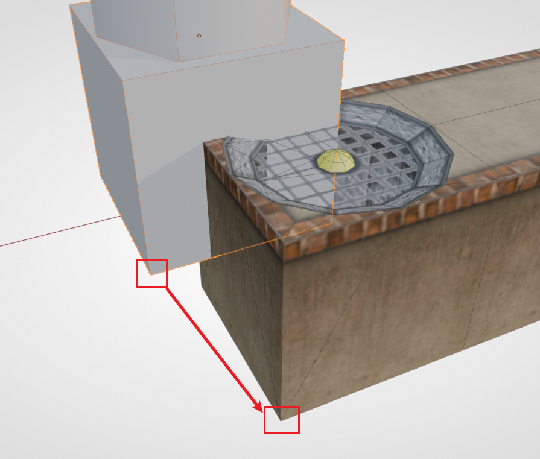
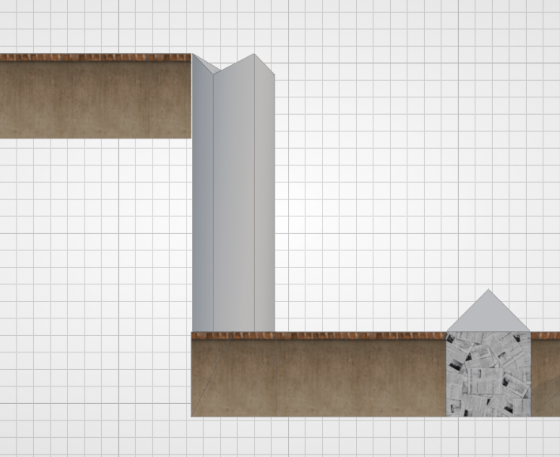
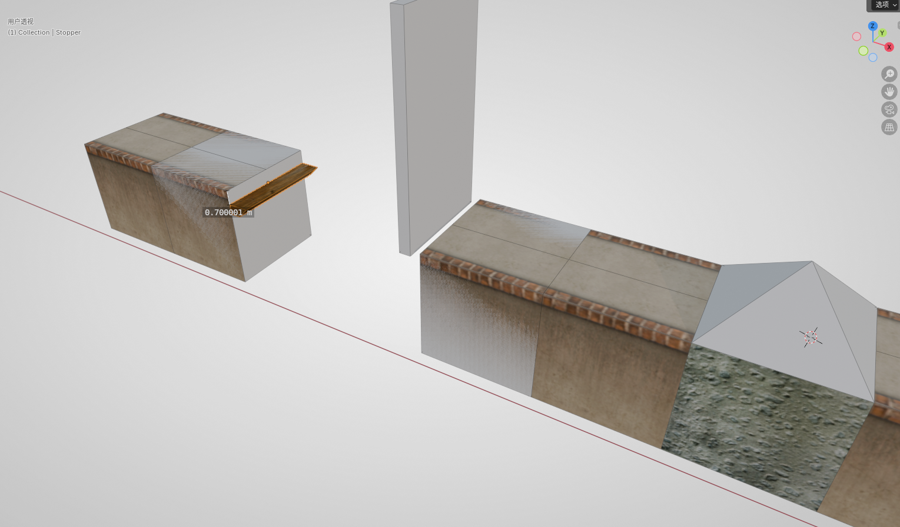
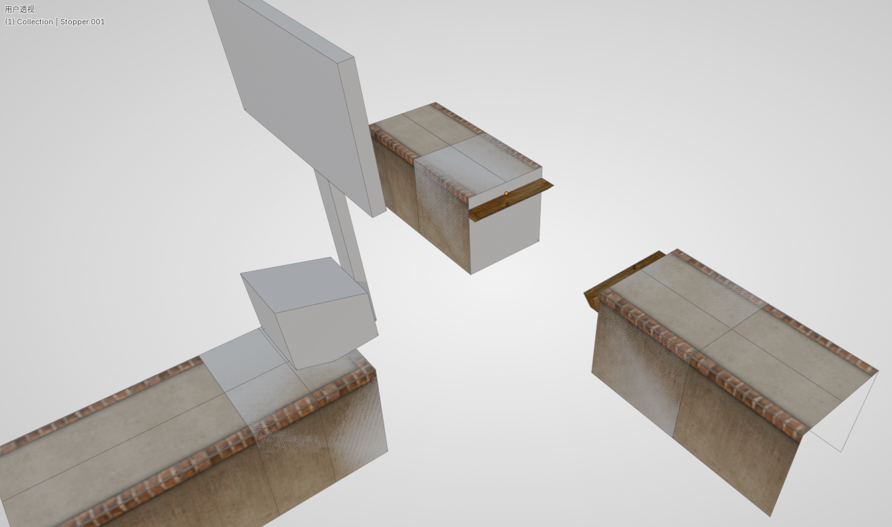
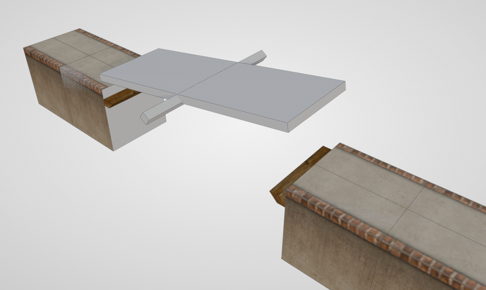
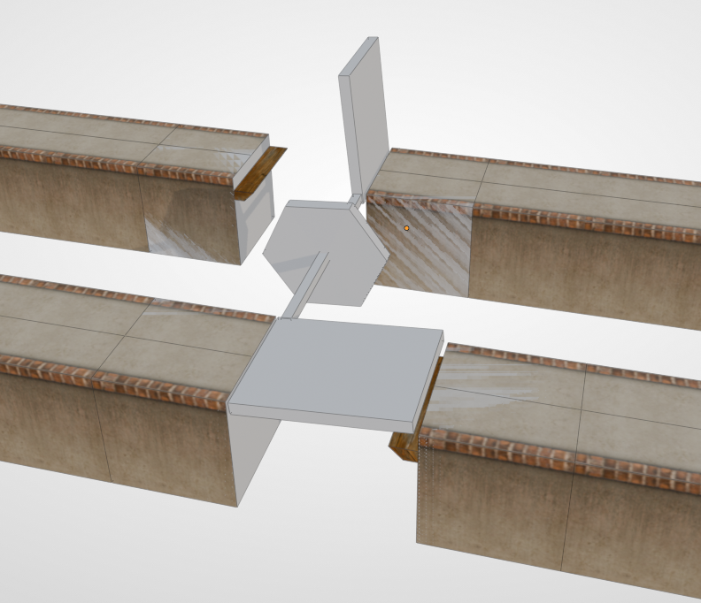
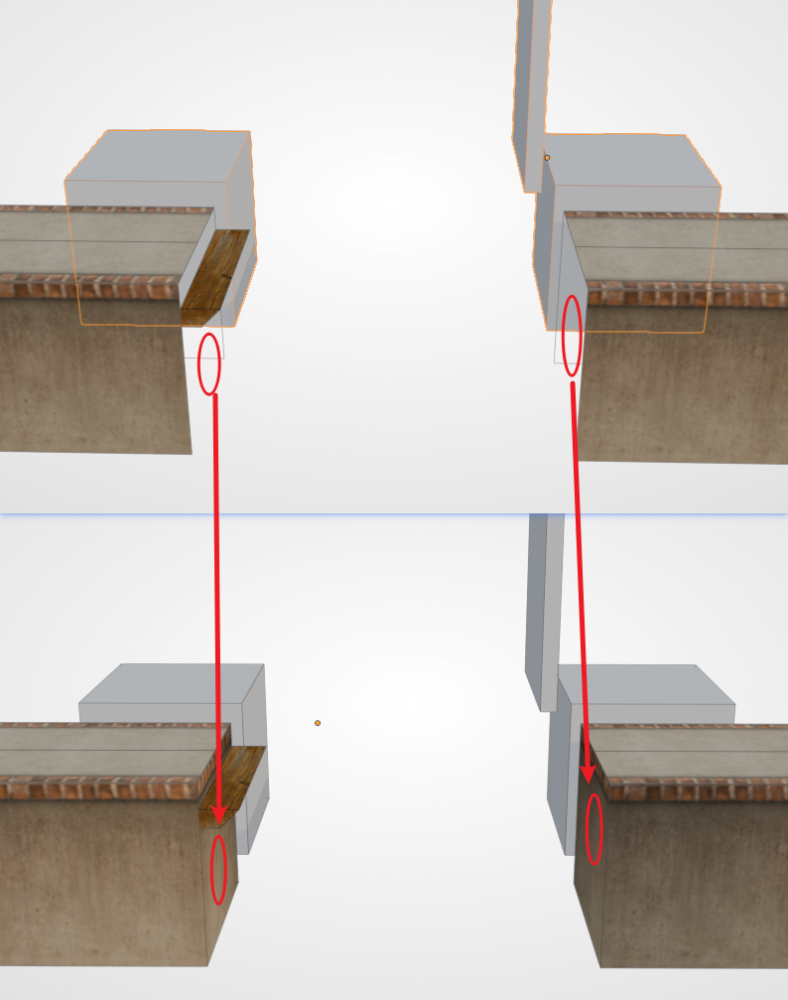

# Sector 3: Placing Modules

In this section we will demonstrate how to place mechanisms. The mechanisms (and props) in Ballance are all **placeholders** in the map file. Just like the checkpoint fire, respawn point, balloon, and so on that we have already seen, they do not look like this in the game — they will be replaced with the real flames and balloon, and the basis for the replacement is actually the Virtools group. The gray models we see in Blender now are only there so that we can better judge which kind of mechanism it is by its shape when mapping. For a detailed explanation of mechanisms, see [Mechanisms and Props](../../mapping/basic/module.md).

## Aligning the Ball Transformer

The ball transformer is a very common mechanism. After the player's ball gets close, it will be sucked in and converted to the corresponding ball type. The placeholder of a ball transformer appears as a triangular pyramid. When placing it, we recommend using the corresponding ball transformer base, so as to better identify the type of ball transformer in the game.

First we place a checkpoint with an extended floor, then assemble a paper ball transformer base at the extended floor. Then align the paper ball transformer to the base using vertex snapping — that is, directly align **the bottom vertex of the transformer** with **the top vertex of the base**.

::: tip Hint
Whenever a mechanism is added, BBP will have a dialog box. You need to choose the correct sector number in order to load this mechanism in the sector you want.

For example, the content of this section is the third sector, so the sector number for the paper ball transformer should be 3. The same applies to all subsequent mechanisms. It doesn't matter if you choose wrong; see [Adjusting the Sector Number](#adjusting-the-sector-number) below.
:::

## The Auxiliary Alignment Block

Next we consider placing a fan to blow the paper ball up so that it can reach a higher place. First we make a short section of floor to prevent the fan and the paper ball from being too close. Then at the end of the road, find a **one-end-open** fan base from the asset library and assemble it on.

::: tip Common Knowledge

1. The fan base and the "wind" of the fan are actually separate: the base is part of the floor and is grouped into the floor group; the wind is a mechanism and is grouped into the mechanism group and the sector group.
2. The fan cannot be too close to a ball transformer. Being too close will cause the wind to not be able to lift the ball after a ball change, and the player needs to back up a bit before being able to be blown up. This is not recommended in design.

:::

Then use BBP to add a **Fan mechanism** (`P_Modul_18`). We notice that there is a block at the bottom of the fan mechanism, and above the block there is a column-like wind pillar, indicating the fan's wind pillar in the game. The purpose of the bottom block is to make it convenient for us to align with the fan base. As shown in the figure below:

Using vertex snapping, we can very conveniently place the mechanism in the correct position. Then we can place a section of floor at the very top to catch the paper ball.

In fact, for any mechanism associated with a floor, its placeholder carries such an auxiliary alignment block, making it convenient for us to quickly add mechanisms. When mapping, you should flexibly use the vertex-snapping alignment method.

## Stopper

Some mechanisms need the player's ball to knock them down, and then they form a new road. For mechanisms like this, after they fall down, there needs to be something to catch them, otherwise they will not properly form a passable floor. This kind of thing is what we call a Stopper.

::: tip Advanced Tip
This name comes from the group name in the game; all such objects are grouped into a group named `Phys_FloorStopper`.
:::

The list of mechanisms that need a Stopper is as follows:

- Push board (25)
- T-board
- Tilting board
- Two-wing bridge / Bidirectional push board

Here we use the push board as an example. First, in the position we just made, continue to add a stone ball transformer, then make a section of floor for a running start, and then add a push board that needs to be pushed by a wood ball or stone ball. Then drag a Stopper out from the asset library and align it to the floor on the other side. **Then drop the Stopper by 0.7 relative to the floor height** (type `G` `Z` `-0.7`). The final effect is shown in the figure below (the height annotations in the figure have errors; when actually mapping, just make it 0.7):

Next, let's look at a few other structures that need a Stopper. (This part only demonstrates the standard placement position of a Stopper; the reader can build them into the map according to their own design)

**T-board**:

**Tilting board**:

**Two-wing bridge / Bidirectional push board**:

::: tip Hint
Stoppers have a problem, namely that only the first Stopper in the map will make a sound when colliding with a mechanism. This is a [bug](../../mapping/basic/floor-and-rail#stopper) in the game's design. To avoid this bug, we can merge all the Stoppers in the map into the same one.
:::

## Filling Faces

When placing mechanisms that come with an auxiliary block, we also need to pay attention to filling the faces of the floor. For example, the push board we placed earlier — note that the auxiliary block may block the side face, making it impossible to detect the missing part. The mechanisms in the game all have no so-called auxiliary alignment block, so the problem of missing faces will be fully exposed, affecting the aesthetics. So when making them, be sure to fill the faces in promptly.

## Continuous Mechanisms

In Ballance, some mechanisms can be used continuously, for example: **fans**, **swings**, **box-type floating boards**. BBP also provides the corresponding tools to quickly create a series of continuous mechanisms, of which the fixed parameters are: `Sector` and `Count`, used to determine the sector the mechanism belongs to, and the number of mechanisms to generate. The special parameter is the offset value / offset vector. Below are a few examples:

- Continuous box-type floating board: the default spacing is 6, which happens to match the spacing that appears in the original.
- Continuous swing: the default spacing is 15, and by default it will stagger the placement of the swings. Staggered placement can make two adjacent swings come close together exactly as they swing, allowing any ball to pass.
- Fan pillar: defaults to a Z-axis offset of 15. This default value can quickly make a vertical fan pillar, which is uncommon in the original but often appears in custom maps. In addition, you can also set a displacement in any direction to make a fan array.

## Stacked Mechanisms

Stacked mechanisms is a term from the Chinese community, often seen in custom maps, and refers to stacking several identical mechanism elements at the same position. There are two common stacked mechanisms: **Stacked Score Balls**, **Stacked Fans**.

- **Stacked Score Balls**

Stacking several extra point balls together; when the player collects them, a great number of chasing extra point balls will burst out. This is generally used for visual effects, or purely as a large score reward to incentivize the player to take the designed route. We notice that after the stacked score balls are generated, their rotation angles are different. This is so that in the game these scores look more pleasing (rather than being stacked on top of each other).

- **Stacked Fans**

A stacked fan stacks multiple fans. When the quantity is sufficient, it can blow up a wood ball and a stone ball, and it can also send a paper ball soaring into the sky, or even prop up props such as wooden boxes. Blowing up a wood ball requires at least **6** fans, while blowing up a stone ball requires at least **32** fans. You can see that the dialog box provides preset quantities; we only need to choose the type of ball. Of course, you can also generate a custom number of fans.

## Adjusting the Sector Number

If you need to adjust the sector number of a mechanism, it is also very simple — you only need to change its grouping. We can find the Virtools groups in the object panel, then remove the sector group (`Sector_0x`), and then add the corresponding sector group. For the specific location, please see: [Grouping in Blender](../../mapping/basic/grouping#grouping-in-blender).

## Next Up

The three basic in-game objects — floors, rails, and mechanisms — are all introduced here, and your map should already be playable. But we are still missing some important decorations, as well as the detection area that lets the player respawn after falling. The introduction of this content is located in the next chapter: [Decorations and Depth Test Cube](decorations-and-depth-test-cube).
