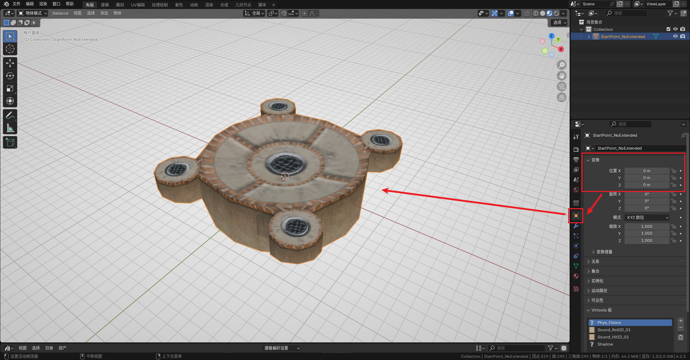
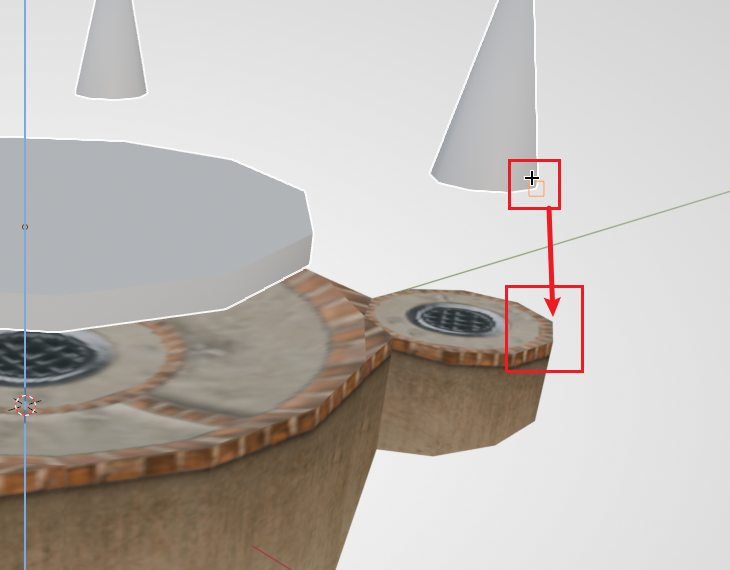
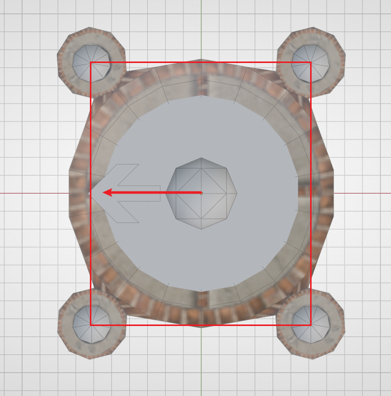

# The Smallest Level

In this section of the tutorial, we will build a custom map that can be imported into Ballance and played, with the least amount of work.

## Preparation

Here we assume that your BBP plugin and Ballance mapping asset library have been correctly installed.

First, just open Blender and enter the default template. In the 3D view, press `A` (select all) and then press `X` (delete) to quickly delete the existing camera, lights, and other objects in the template. These are not needed when mapping for Ballance.

Next, drag out the timeline panel at the bottom of Blender, change it to the Asset Browser, and find our Ballance assets. This makes it convenient for us to take content from the asset library at any time during the subsequent workflow. When you don't need the asset library, you can also drag the panel back to give the 3D view more operating space.

Then save this Blender project to any location you like, to prevent the content we make from being lost. During the production process, please also remember to save frequently, to prevent extreme situations such as a sudden power outage or Blender crash from causing the map to be lost.

## Placing the Checkpoint Floor

"Checkpoint" is an old term in the Chinese Ballance community, also known as a save point, checkpoint, and so on. In the game, the places burning with four or two flames are checkpoints. Since the player generally starts out from a checkpoint, we first build a most basic checkpoint.

First open the asset library, find a **four-flame checkpoint floor** without any extended floor in it, and drag it into the 3D view to place it. At this point, notice that the placed checkpoint has no material display. In the 3D view, press `Z` and move the mouse downward, then release `Z` to switch to **Material Preview mode**. In this mode you can see the material display of most objects, which is convenient for mapping.

Generally, we recommend placing the checkpoint at the exact center of the map, that is, the origin position. In the object panel on the right, change its coordinates to `(0, 0, 0)`.

Note that this is only the floor of a checkpoint; we are still missing the **checkpoint flames** and the **respawn point**.

## Placing the Checkpoint Fire and Respawn Point

In the game, in addition to the checkpoint floor, a checkpoint also has **flames** (also called a checkpoint; when the player reaches the flame, the next sector will be triggered), and you also need to specify the player ball's **respawn point** (the player ball will revive at the respawn point position after dying).

Because the checkpoint structure is highly repetitive, BBP provides us with a **Sector Checkpoint Pair** (i.e. the combination of respawn point + checkpoint flame). Press `Shift + A` to add a **Sector Pair** (Sector Pair), and choose the sector number `1`. When the sector number is 1, BBP generates **four flames and a respawn point**; for other values BBP generates **two flames and a respawn point** — be sure to note the difference.

Since we placed the checkpoint at the center of the map in the previous step, the sector pair generated in this step does not need its XY position adjusted; only the Z position needs to be adjusted.

::: tip About the 3D Cursor
Objects created by Blender "by convention" will be located at the 3D cursor. The 3D cursor is a special indicator in Blender, appearing in the view as a red-and-white striped circle with four lines pointing to the center, like a crosshair. Hold `Shift + S` to quickly adjust its position, or use the 3D cursor to adjust an object's position.

Before adding the sector pair, we recommend first moving the 3D cursor to the checkpoint (select the checkpoint, hold `Shift + S`, and choose the option directly below), and then add it. This ensures that the added checkpoint fire and respawn point are vertically aligned with the checkpoint by default, and we only need to adjust the Z coordinate.
:::

::: tip Hint
The operations below use [Move Operations](../../mapping/blender/basic-manual) and [Snapping Operations](../../mapping/blender/snapping) in Blender.
:::

First, while keeping both the flame and respawn point selected at the same time, type `G` `Z` to raise their positions, making them easier to observe. Then press `G` `Z` `B`, select **the bottom of any one of the flames**, and then snap it to the **top** of the checkpoint.

If at this point you find that the positions of the flame and the checkpoint do not match up, or you want to change the facing direction of the spawn point (the arrow model on the respawn point represents the direction the player faces when spawning), you can select only the part you want to adjust, type `R` `Z` `90` to rotate it 90 degrees. By convention, we want to let the player ball start out from the wider side. The figure below is a correct example (top view):

In addition, in imitation of the original style, we should try to keep the relative vertical positions of the respawn point, the flame, and the checkpoint floor, which can make our custom map feel more like the original when played.

::: warning Note
Editing the respawn point's mesh is invalid; similarly, do not apply the respawn point object's rotation to the mesh!
:::

## Adding the Finish Balloon

At this point our map still only has one sector. Adding the finish balloon cannot make the level completable, but the point is to let your map be loaded by Ballance, so that even if it can't be completed, you can open the game and import the map to take a look at your work after finishing any subsequent work.

Adding the finish is very simple: in `Shift + A`, add a **Finish Balloon (PE_Balloon)**.

Since a map with only one sector cannot load the balloon normally, for now the position of the finish balloon is not important. You can ignore it for now, as long as it has been added.

::: tip Hint
You can also make the sector checkpoint for the second sector right now, so that in the game you can use cheat mode to fly to the second sector and then finish the level. The subsequent tutorial will no longer cover the detailed steps for making a checkpoint; if you forget how to make one, remember to come back and look at this section.
:::

## Viewing in the Game

Next is exporting to an NMO file. The map file format of Ballance is NMO, a file format dedicated to Virtools. In the past mapping methods, we had to use Virtools, an extremely old tool, to save, in order to get a map that could be played normally. But thanks to yyc's libcmo21 and BBP, we can export NMO files directly from Blender.

In Blender's top-left "File" menu, find "Export", and choose Virtools file. The export options on the right are explained as follows:

- Export target: Generally we can just choose a collection. This tutorial will not use multiple collections, so just choose Blender's default Collection collection.
- Encoding: When there are no special requirements, keep the default (`cp1252;gb2312`).
- Global texture save option: If no custom textures are used, always choose **External**.
- Use compression: Recommended to be enabled; keep the default. If the map file is too large, you can consider raising the compression level; generally the impact is small.
- Continuous sector count: Recommended to be enabled. BBP will automatically analyze the number of sectors in your map, so as to generate the finish balloon at the correct time.

The exported NMO file does not need any processing. Just play it in Ballance exactly as you normally play a custom map. It is recommended to install BML/BMLP and enable cheat mode. Many of its features can help you test your own map more conveniently.

After you complete any milestone operation, you can export the map and view the result in the game. This gives you instant feedback, and also lets you promptly test whether your map can be played normally, whether there are model issues/material issues, and so on.

## Next Up

Read the next chapter: [Sector 1: Assembling Floors](sector-1).
