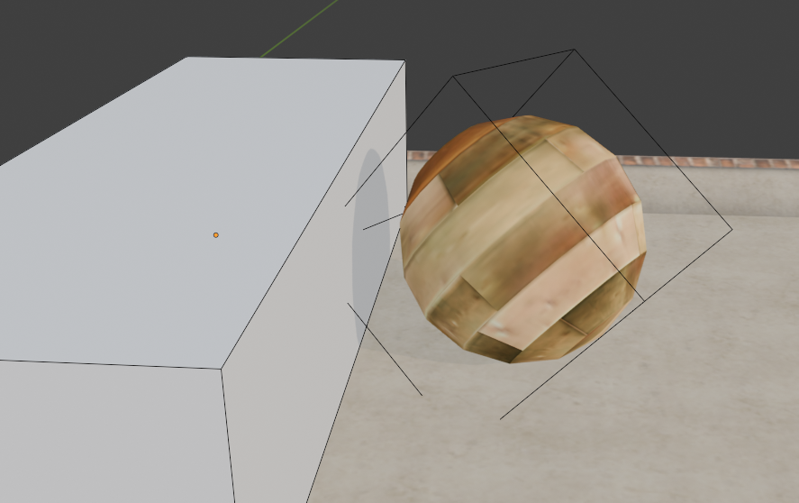

# 死亡区

死亡区是 Ballance 游戏中的一种特殊物体，当玩家球碰到它的时候就会死亡，回到重生点。

死亡区的判定是按照其边界盒（Bounding Box）来判断的，玩家球的边界盒与死亡区的边界盒重合，就判定为接触。

::: tip 提示
边界盒可以跟随物体旋转和缩放，因此死亡区可以任意地旋转和缩放。
:::

由于死亡区是基于边界盒来处理检测，所以我们可以简单地将玩家球和死亡区均看成长方体。例如下图这种情况，即使视觉上玩家球和死亡区并未接触，但还是能触发玩家球的死亡。

使用不同形状的死亡区是没有意义的，在游戏层面只会以方形的边界盒来判定。所以为了保持基本正确的视觉预览，我们建议 **制作死亡区时只使用长方体**，简单直观。

::: tip 重要提示
发布地图前记得将死亡区隐藏哦！
:::
