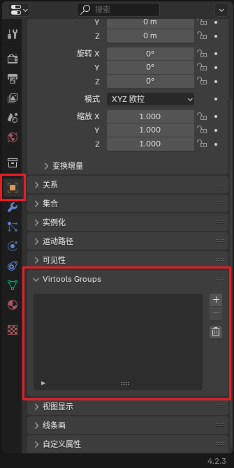

# 归组

组是 Virtools 中的重要概念。通过归组，Ballance 才知道哪些物体是路面，哪些物体是机关，哪些物体又是装饰，并为它们赋予各自不同的属性和行为。地图中的任何物体，只有归入相应的组中，才会具有相应的功能，否则就是只能看见无法互动的模型。

更详细的归组信息与规则可以在 [Ballance Wiki 的归组页面](https://ballance.jxpxxzj.cn/wiki/%E5%BD%92%E7%BB%84) 中查询。

在 Blender 当中，由插件生成的物体、制图资产库中的物体，均已经归好组，除非特殊需求，一般无需做过多调整。

## 基本规则

首先简单介绍一下 Virtools 组的概念：

- 每一个组都有一个名称，例如 `Phys_Floors`、`Sector_01`、`My_Custom_Group` 等。
- 每一个组包含一个物体列表，列表中的物体我们称为它被归入了这个组。
- 同一个物体可以归入多个组。
- 组之间不互相嵌套。

Ballance 通过一些 [预定义的组](#ballance-预定义组) 的名称，来为组内的物体赋予不同的特性。例如路面组（`Phys_Floors`）中的物体会被物理化，使其具备碰撞箱；道具组中的物体会被替换为真正的机关道具等。

例如，一个可行走的路面应当归入以下组中：

- `Phys_Floors`：使路面物理化，否则无法与玩家球发生碰撞。
- `Sound_HitID_01`：玩家与该组物体碰撞时会发出水泥地面的碰撞音效。
- `Sound_RollID_01`：玩家球在该组物体滚动时会发出水泥地面的滚动音效。
- `Shadow`：玩家球在该组物体上方一定距离内时会投射出影子。

## 在 Blender 中归组

::: warning 注意
该功能由 BallanceBlenderPlugin 提供。请确保您已 [正确安装了 BallanceBlenderPlugin](../intro/installations.md#ballance-blender-plugin)。
:::

在 Blender 中，每个物体的物体属性面板内能够找到 `Virtools Groups` 菜单，可以添加所有 Ballance 支持的预定义的组，也可添加自定义名称的组。所有组信息会在导出时自动转化为 Virtools 组。

另外，由插件生成的物体、制图资产库中的物体，均已经归好组，除非特殊需求，一般无需做过多调整。

## Ballance 预定义组

Ballance 提供了一系列预定义的组，把物体归入这些组，就能让物体获得相应的特性。下表列出了所有预定义的组的名称与作用：

### 特殊组

特殊组是关卡中非常重要的一部分，组中的物体保证了关卡正常游玩。若缺失其中的一些则会导致关卡无法正常游玩，甚至有可能导致关卡无法进入、游戏卡死等问题。

由于这些组的特殊性，部分组内的物体有着严格的命名规则，具体规则在表中列出。

| 组名称         | 含义       | 组内物体命名规则 | 备注                                    |
| -------------- | ---------- | ---------------- | --------------------------------------- |
| PS_Levelstart  | 起始存档点 | PS_FourFlames_01 | 只能有初始存档点一个物体                |
| PC_Checkpoints | 小节存档点 | PC_TwoFlames_0X  | 其中 X 是小节序号 **减一**              |
| PR_Resetpoints | 重生点     | PR_Resetpoint_0X | 其中 X 是小节序号                       |
| PE_Levelende   | 飞船       | PE_Balloon_01    | 只能有飞船一个物体                      |
| DepthTestCubes | 死亡区     | 无要求           | 死亡区的范围根据物体的 BoundingBox 判断 |

::: tip 提示
无需在意上述命名规则，默认情况下 BallanceBlenderPlugin 会自动帮我们处理。
:::

### 固定物体组

游戏中 **固定的能够发生碰撞的** 物体需要归入下表所示的组中。这些组会使他们具有物理效果，能够与其它物体发生碰撞。

| 组名称            | 含义                       | 备注                                                     |
| ----------------- | -------------------------- | -------------------------------------------------------- |
| Phys_Floors       | 使组内物体物理化为路面     |                                                          |
| Phys_FloorRails   | 使组内物体物理化为钢轨     |                                                          |
| Phys_Floorstopper | 使组内物体物理化为 Stopper | Stopper 无法与玩家球发生碰撞 但可与机关道具等发生碰撞 |

::: tip 什么是物理化？
物理化（英文 Physicalize）是指让物体具有碰撞效果，使其能够与其它物体发生碰撞。不经过物理化的物体，在游戏中是没有任何物理属性，也无法发生碰撞的。
:::

除了物理效果外，完整的物体还需要有一定的修饰，使他们具有互动音效、影子等效果。

| 组名称          | 含义                           |
| --------------- | ------------------------------ |
| Sound_HitID_01  | 水泥碰撞音效组                 |
| Sound_HitID_02  | 木板碰撞音效组                 |
| Sound_HitID_03  | 钢轨碰撞音效组                 |
| Sound_RollID_01 | 水泥滚动音效组                 |
| Sound_RollID_02 | 木板滚动音效组                 |
| Sound_RollID_03 | 钢轨滚动音效组                 |
| Shadow          | 使组内的物体能够投射玩家球影子 |

### 机关道具组

| 组名称        | 含义          |
| ------------- | ------------- |
| Sector_0**X** | 第 **X** 小节 |
| P_Trafo_Paper | 纸球变球器    |
| P_Trafo_Stone | 石球变球器    |
| P_Trafo_Wood  | 木球变球器    |
| P_Ball_Paper  | 道具纸球      |
| P_Ball_Stone  | 道具石球      |
| P_Ball_Wood   | 道具木球      |
| P_Box         | 箱子          |
| P_Dome        | Dome          |
| P_Extra_Life  | 生命球        |
| P_Extra_Point | 分数球        |
| P_Modul_01    | 活式木栅栏    |
| P_Modul_03    | 升降机        |
| P_Modul_08    | 秋千          |
| P_Modul_17    | 单摆          |
| P_Modul_18    | 风扇          |
| P_Modul_19    | 双向挡板      |
| P_Modul_25    | 推板          |
| P_Modul_26    | 沙袋          |
| P_Modul_29    | 软木桥        |
| P_Modul_30    | 跷跷板        |
| P_Modul_34    | 落石          |
| P_Modul_37    | T型板         |
| P_Modul_41    | 箱式浮板      |
