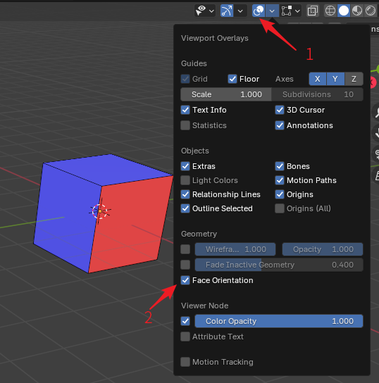

# 疑难杂症

此页记录一些制图过程中常见的疑难杂症。如遇到这里没有记录的问题，欢迎 [加群反馈](../intro/introduction#社区与支持)。

## 路面发黑

该问题主要表现为：在 Blender 和 Virtools 中查看路面均为正常，但在游戏中看到的就出现了大面积不规则的黑色。

受限于篇幅，该问题参见 [路面发黑问题](black-floor)。

## 路面影子异常

::: tip 关于“缺影子”的问题
路面影子问题曾是困扰 Ballance 制图界许久的一个问题，该问题在正式发现原理前的解决方案是从原版关卡中获取物体，然后将我们的物体的网格赋予这个物体。~~这样的反复操作显得非常的蠢。~~

使用 BBP 导出的 Ballance 地图完全不需要担心影子问题，只要将需要显示影子的物体归入 Shadow 组中，即可在游戏中获得正常的影子显示。对于其它缺少影子的地图（指的是那些已经归了 Shadow 组，但是没有影子产生的地图），也可以通过将其导入 Blender 中后再直接导出，简单地进行修复。
:::

有时合并路面后导出至游戏中影子可能会发生异常，例如影子产生拉伸形变、投射到其它物体上等。

一种简单的解决方案是选中有异常的路面，按 `Ctrl + A` 应用 `全部变换` 即可，同时也可以检查该物体是否有修改器未应用。

## 透明材质问题

由于 Blender 与 Virtools 的材质系统并不兼容，有时可能会出现“在 Blender 中正确显示了透明，但在游戏中不透明/遮住其它物体/无法正确混合颜色”等问题。

解决方案详见 [材质贴图：半透明材质](texture#半透明材质)。

## 透明贴图问题

Ballance 中的透明贴图是一个常见视觉渲染错误问题。不同于上述的透明材质问题，透明贴图问题指的是游戏内本身就自带透明通道的图片，在游戏中加载异常。

透明贴图问题的一个典型表现是 **柱子不断问题**。即制图者制作的柱子在游戏中会类似于被切断，可以看到很清晰的切断轮廓，而原版的柱子是逐渐延申到背景中的。

柱子不断问题曾是困扰 Ballance 制图界许久的一个问题，该问题在本插件面世之前的最终解决方案是通过 chirs241097 所发明的地图内嵌脚本来解决的。但这对于制图新手相当麻烦。

**通过 BBP 导出的 Ballance 地图，默认情况下其柱子是保证不断的。**

通过 BBP 导出的地图的行为更贴近为原版关卡的行为，即只要通过 Virtools 再打开并保存一次，柱子就会断掉。所以如果你的地图不涉及使用 Virtools 再编辑（比如添加脚本之类的），那导出的地图就可以直接发布游玩。如果你使用了 Virtools 进行编辑，那就必须要遵循 chirs241097 所编写的教程，编写地图内嵌脚本，并修改柱子贴图文件的 Video Format。

与柱子不断问题相似的还有灯笼的黄色光芒，风扇网格的透明等问题。这些问题和柱子不断一样，只要不涉及 Virtools 重新保存，就不需要特别关注它们。

::: info 冷知识
**柱子不断问题** 指的是“如何让柱子不断”这一问题，而不是“柱子为何不断”。
:::

## 碰撞不匹配

对一个路面缩放后，游戏中可能会出现它的碰撞箱和视觉模型不匹配的情况。

由于 Ballance 的底层所限制，尽量不要对一个需要物理化的物体进行缩放（例如归在 `Phys_Floors`、`Phys_FloorRails` 和 `Phys_FloorStopper` 的物体）。

如果已经缩放好了，需要保持大小，可以在 Blender 中使用 `Alt + S` 消除物体的缩放。或按 `Alt + A` 然后选择 **应用缩放**。

## 翻面

Ballance 基于性能考量，会对大多数物体进行背面剔除操作。被背面剔除的面不会在游戏里渲染，这也是导致关卡渲染不正确的原因之一。总而言之翻面问题在 Ballance 制图中尤其需要注意。下图介绍了一个面的正反区别，以及如何在 Blender 中观察面的正反：

为了观察面的正反，首先需要在右上角打开视图叠加层（箭头 1 所示。不需要编辑模式，物体模式下就可以），然后勾选 Geometry 分类下的 Face Orientation 选项，即可打开面朝向显示。打开后物体会被蒙上一层蓝色或红色的遮罩，蓝色的遮罩表示法线指向当前视角的纸外，红色表示指向纸内，也就是所谓的法线翻转了。通常情况下只需要观察视野里是否有红色出现，然后对齐使用编辑模式下的菜单 `Mesh - Normals - Flip` 将其法线翻转修正即可。

Ballance 并不是会对所有物体都做背面剔除，你可以通过材质强制指定某个面不进行背面剔除，例如原版关卡的灯柱中的黄色灯光就没有做背面剔除。为了不被背面剔除，也就是所谓实现双面显示，需要做的事情就是将需要双面显示的面的材质中的 Two Sided 勾选上，然后应用即可。需要注意的是，最好将需要双面显示的部分单独用一个独立的材质，因为双面显示需要消耗的绘图性能可能比较多，如果全图都用了双面显示可能会很卡。

顺带一提，Blender 材质的背面剔除，与 Virtools Material 中的 Two Sided 选项进行了同步。因此如果你在 Blender 中无法观察到一个面，那么大概率在游戏里也看不到它，这样可以直观地给制图人提供一个背面剔除下的预览。

## Stopper 没有声音

参见 [Stopper 介绍](../basic/floor-and-rail#stopper)。

## 工程文件过大

一般而言，BBP 导出 nmo 文件的时候只会导出你选择的那些 3D 物体，不会产生无用物体，一般不存在 nmo 文件过大的情况。 ~~除非你自己真的塞了巨量内容进去。~~

此处指的是 Blender 工程文件过大，可以使用 Blender 中 `File` - `Clean Up` 的 `Purge Unused Data` 功能。
