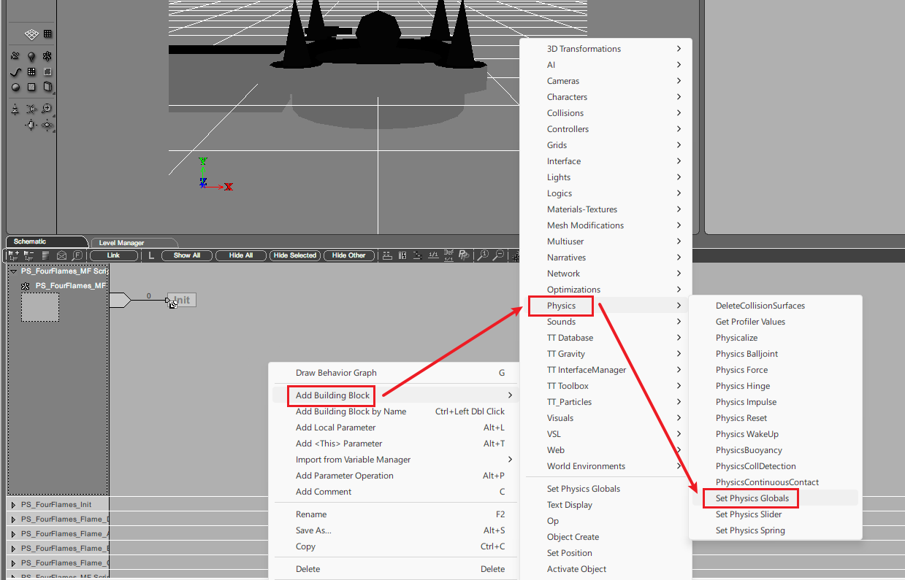
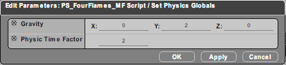
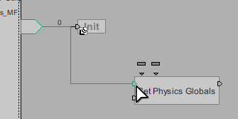

# 快速开始

本节将在不需要了解脚本细节的前提下演示如何在一张自制图中快速插入并运行一个简单的脚本。

## 准备工作

首先下载好基本工具。制作脚本图需要以下工具：

| 工具                      | 作者   | 备注                             |
| ------------------------- | ------ | -------------------------------- |
| Virtools 2.5 for Ballance | doyagu | 用于编辑脚本，必备               |
| 脚本插入模板.cmo          | -      | 将脚本插入地图的模板，减少工作量 |

::: warning 注意
注意，请尽量使用 **Virtools 2.5**，而不是 Ballance 社区常见的 Virtools 3.x。因为本手册所提供的 2.5 版本支持直接使用 Ballance 自带的特殊构建单元，且自带脚本解密功能，而 3.x 均不支持，不利于脚本制图。
:::

工具下载请参考 [资源下载提示](../../mapping/intro/installations#资源下载提示)。

然后准备任意一张能够正常游玩的地图（建议使用原版地图尝试，或使用 Blender 快速制作一张最小的可游玩的地图）。

## 插入脚本

首先打开 Virtools，在左上角工具栏 `Resources - Import File` 处导入事先准备好的地图，并且检查地图是否已经插入了脚本。一个简单的方法是：导入地图后，找到 `Schematic` 选项卡，若里面是空白，则该地图没有插入脚本。

::: warning 提示
需要提前检查的原因是，假如你打开了一张基于 **梨栠 3ds Max 制图流程** 制作的地图，地图内应该会自带数个脚本。这些脚本与脚本插入模板的作用类似，因此无需重复插入脚本。

**若该地图已经插入了脚本**，则无需重复插入，**可以直接跳过此步骤**。
:::

在左上角工具栏选择 `File - Merge Composition...` 导入 `脚本插入模板.cmo`。

::: tip 提示
若导入时出现弹窗提示，一般是由于模板和地图中的材质重名，不需要担心，选择 `Replace` 或 `Ignore` 均可。
:::

导入成功后再次查看 `Schematic` 选项卡，应该会出现一些可编辑区域，下一步我们将会在此处编写一些简单的脚本。

## 编写脚本

右键脚本的空白处，依次选择 `Add Building Block - Physics`，添加一个 `Set Physics Globals` 构建单元。该构建单元能够设置物理引擎的物理常量，例如：重力向量、物理模拟速率。

添加好构建单元后，可以开始设置构建单元的参数。双击该构建单元，进入参数设置界面。我们将重力（Gravity）设置为 `0, 2, 0`，将物理模拟速率（Physics Time Factor）设置为 `2`。这样设置就是让重力变为轻微向上。

::: tip 热知识
Ballance 默认的物理模拟速率就是 2，可以理解成游戏的物理引擎默认设置了一个 2 倍速。将此处设置为 1 则可以得到一个 0.5 倍速运行的 Ballance 地图。
:::

然后将该构建单元的入口连接到脚本的入口。脚本的入口是左侧的箭头，我们需要将其连接到构建单元的左上第一个入口。

::: warning 每个入口有不一样的作用
新人常见的一个误区是：认为构建单元的左侧第一个入口就是启动入口。实际上每一个入口都负责不同逻辑的启动，在使用前可以将鼠标停留在入口上查看其名称。
:::

按住脚本入口，拖拽到构建单元的入口上松开即可。反方向连接也是一样的，左键按住构建单元的入口，拖拽到脚本的入口上亦可。能够连接时，连接线会显示为绿色，此时松开鼠标即可连接，连接线变回黑色。

## 导出运行

导出脚本图的方式与基础制图略有不同，但也可以使用一般的导出方法。在 `Level Manager` 选项卡中，右键 `Level`，选择 `Save as...`，保存为 nmo 文件即可。

进入游戏，即可看到重力已经变为轻微向上的效果，球和道具都会慢慢地上浮。

::: warning 注意事项
**使用 `Save as` 保存的 nmo 文件会丢失 IC 信息。**

虽然在本节教程中没有使用到 IC，但如果你在编写脚本时，为某些物体指定了 IC，请直接将项目保存为 cmo（按下 `Ctrl + S` 或菜单栏选择 `File - Save Composition` 均可），然后手动更改后缀为 nmo，再导入游戏游玩。
:::

## 进一步学习

接下来可以了解 [脚本插入原理](scripts-insertion) 以及 [脚本相关的基础概念](basic-concepts)。也可以学习一些 Virtools 脚本相关的[基础操作](basic-operations)。

学习了基础知识后可以根据左侧的目录，有目的性地查看你所想了解的内容。建议一定要带有目的地去制图，而不是盲目地想要学习完所有的教程再开始制图，这样也违背了手册的初衷。
