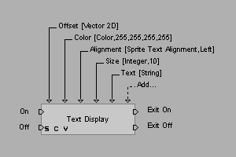

# 构建单元概述

构建单元在 Virtools 中被称为 **Building Block**，社区简称 **BB**。

BB 是脚本中的最小单元之一，它代表了一个 **功能**，并且能够提供多种执行方式，以及参数的输入输出。

## 输入输出

一个 BB 可以对应着四种输入输出：

- 逻辑输入（位于左侧，一定有）
- 逻辑输出（位于右侧，不一定有）
- 值输入（上方三角形，不一定有）
- 值输出（下方三角形，不一定有，另：上图中没有值输出）

当 BB 左侧的 **任意输入口** 被激活时，BB 会从其上方的 **值输入口** 读取参数，然后执行对应的功能（一般一个输入口对应一个具体的功能）。执行完毕后，将执行得到的结果放在下方的 **值输出口**（如果有），然后激活右侧的 **逻辑输出口**（如果有）。

::: warning 注意
输入输出口并不是完全一对一地对应激活。虽然在下文的例子中，`On` 对应激活 `Exit On`、`Off` 对应激活 `Exit Off`，但不代表所有 BB 都有这样的对应关系。应根据输入输出口的名称与文档（如果有）进行脚本编写。
:::

## 示例

例如下图是一个名为 `Text Display` 的 BB 的文档以及示意图，它的作用是在屏幕上显示文本：

在这个例子中，若左侧 `On` 被激活，则 BB 会从上方读取参数，将文字显示在屏幕上。

参数共有 5 个，和图中的值输入口一一对应，具体如下表所示：

| 参数名称  | 类型      | 解释         | 默认值                 |
| --------- | --------- | ------------ | ---------------------- |
| Offset    | Vector 2D | 位置         | `(0, 0)`               |
| Color     | Color     | 颜色         | `(255, 255, 255, 255)` |
| Alignment | -         | 对齐方式     | `Left`                 |
| Size      | Integer   | 字体大小     | `10`                   |
| Text      | String    | 要显示的文本 |                        |

执行完毕后，右侧的 `Exit On` 口会被激活。如果它连接到了下一个 BB，那么下一个 BB 对应的输入口就会被激活。
