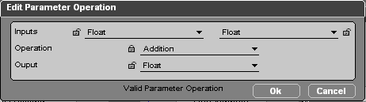

# OP

OP 全称 Operate Parameter，是 vt 中操作变量的方法，一般用于对 1~2 个变量进行计算，得到一个结果。可以通过设置不同的运算模式获取不同的结果，只要运算和变量类型兼容即可。

## 类型

OP 分为两种：

| 类型     | BB                                                 | Parameter Operation                                            |
| -------- | -------------------------------------------------- | -------------------------------------------------------------- |
| 何时计算 | 在 BB 触发时计算                                   | 在下游需要时计算                                               |
| 如何添加 | 和其它 BB 添加方式一致                             | 右键菜单选择 `Add Parameter Operation` 或按快捷键 `Alt + P` |
| 如何配置 | 右键选择 `Edit Settings`  或选中后按 `S` 快捷键 | 创建时直接配置 或者左键双击                                 |

## 配置

OP 的配置界面如下：

OP 的主要逻辑是：使用 `Inputs` 的两个变量，通过 `Operation` 的运算方式，得到 `Output` 的结果。例如图中的配置表示的是将两个 `Float` 值相加得到一个新的 `Float` 值。

## 类型兼容

运算方式和变量类型必须兼容，否则无法进行运算。例如不能将 `Vector 3D` 和 `Float` 相加。

判断是否可行的方式很简单，若无法进行运算，配置页面就不会出现 `OK` 按钮。

::: tip 提示
想要找到某些类型所支持的运算，或者想找到某些运算所支持的类型，可以使用配置界面上的 🔒 **锁定按钮**。锁定了一部分配置后，剩下的配置会自动适应，下拉选项也会仅展示可用的类型。
:::

## None 类型

有些操作可能只需要一个输入变量即可进行，例如 `Get Position` 只需要给入一个 `3D Object` 即可。而 OP 默认有两个输入变量，此时为了正确配置以显示 `OK` 按钮，另一个输入变量可以设置为 `None`，表示不使用这个变量。
